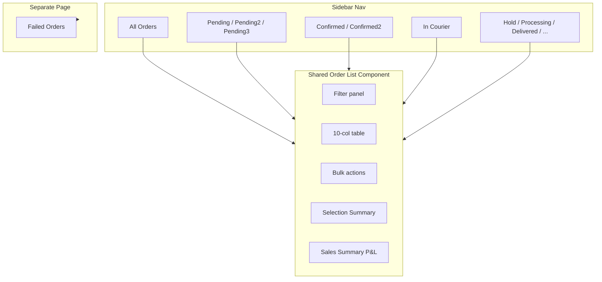
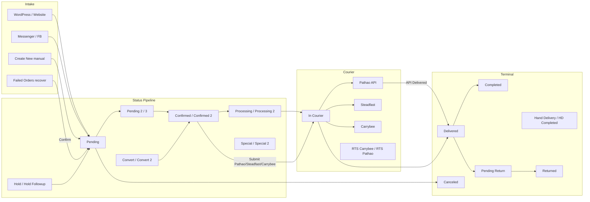
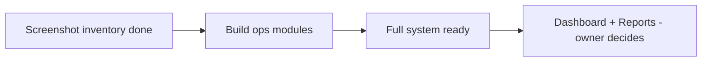
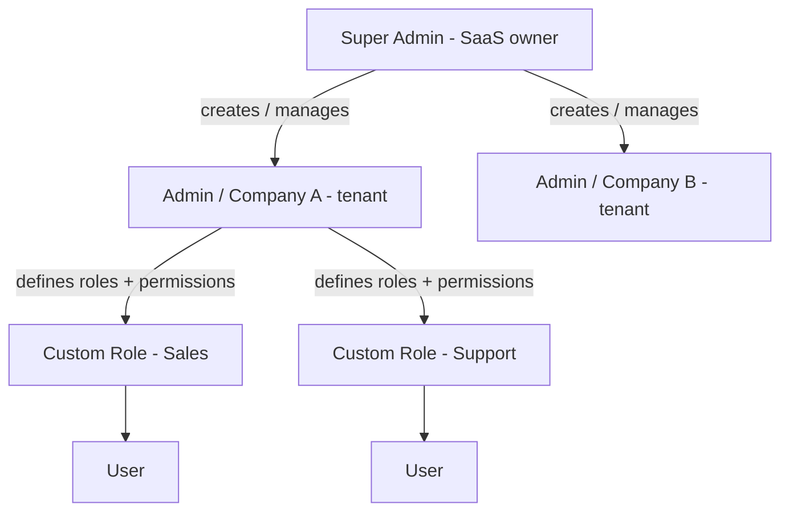
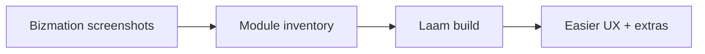

# Bizmation CRM → Laam CRM Requirement Spec

Living document. Screenshot থেকে Bizmation features inventory করা হয়; আপনার সিদ্ধান্ত অনুযায়ী MVP scope ঠিক করা হয়। **এই doc implementation নয় — শুধু requirement reference।**

---

## 1. Meta

| Field | Value |
|-------|-------|
| Reference product | **Bizmation** |
| Target product | **Laam CRM** (Fardus monorepo) |
| Design rule | Bizmation-এর **structure, fields, flow** match; **visual style** Laam design system (shadcn/Tailwind) |
| Build strategy | Phase 1: UI + mock data → Phase 2: API (+ DB later) |
| Product vision | **Bizmation = reference** → Laam same ops flow, **easier UX**, + **extra features** where it helps |
| Doc owner | Product owner (you) + AI assistant |
| Last updated | 2026-06-29 |
| Latest screenshot batch | **Ops modules SS done; Dashboard + Reports deferred by owner** |
| Screenshot-First plan | Active — Section 7 queue + Section 8 interim assessment |

### How to use this doc

1. Screenshot batch পাঠান (chat-এ image attach)।
2. Assistant screen analyze করে **Section 3**-এ inventory লিখবে।
3. আপনি **MVP: Yes / No / Later** confirm করবেন → **Section 2** আপডেট।
4. **Section 6 Changelog**-এ batch note যোগ হবে।

### Screenshot batch checklist (পাঠানোর সময়)

- [x] Menu path noted? — Batch 0: sidebar; Batch 5a: Create New; Batch 5b: All Orders; Batch 5c: Order Detail
- [ ] Screen URL (address bar) visible?
- [x] Login role noted? — Batch 5a: profile "Lalam" visible
- [x] List + detail — Batch 5c order detail captured; Batch 2/3 awaiting

---

## 2. MVP Scope (your decisions)

**Legend:** `Proposed` = plan অনুযায়ী ধারণা; `Confirmed` = আপনি বলেছেন; `TBD` = screenshot দেখে ঠিক হবে

| Priority | Module | Bizmation menu | Laam route | Include? | Notes |
|----------|--------|----------------|------------|----------|-------|
| P0 | Dashboard | Dashboard | `/dashboard` | **Deferred** | Full system ready → owner decides widgets; placeholder OK |
| P0 | Orders → All Orders (full) | Orders → All Orders | `/dashboard/orders` | **Later** | Batch 5b documented; basic scaffold only for now |
| P0 | Orders → Detail/Edit (full) | Order row click | `/dashboard/orders/[orderId]` | **Later** | Batch 5c documented; basic scaffold only for now |
| P0 | Orders (queues) | Orders (33+ sub-items) | `/dashboard/orders?status=…` | **Yes** | Shared list + Failed page — Phase 1 started |
| P0 | Orders → Create New | Orders → Create New | `/dashboard/orders/new` | **Confirmed** | **Full match** — page scaffold live |
| P0 | Pre Orders/Lead | Pre Orders/Lead | `/dashboard/leads` (proposed map) | **TBD** | Batch — page screenshot |
| P0 | Customers | Customers | `/dashboard/companies` | **TBD** | Batch — page screenshot |
| P1 | Followups | Followups (badge: 285) | `/dashboard/followups` (proposed) | **TBD** | List captured — badge = pending count |
| P1 | Followups 2 | Followups 2 | `/dashboard/followups?queue=2` (proposed) | **TBD** | **Same UI** — status queue 2 |
| P1 | Followups 3 | Followups 3 | `/dashboard/followups?queue=3` (proposed) | **TBD** | **Same UI** — status queue 3 |
| P1 | Inventory | Inventory (6 sub-items) | — | **TBD** | Laam-এ নেই |
| P1 | Reports | Report (12 sub-items) | `/dashboard/reports` | **Deferred** | Full system ready → owner decides which reports |
| P2 | Settings | Settings (9 sub-items) | `/dashboard/settings` | **TBD** | Courier/SMS critical for BD |
| P2 | Steadfast Notifications | Steadfast Notifications | — | **TBD** | BD courier integration |
| P2 | Support Tickets | Support Tickets | — | **TBD** | |
| P2 | Coupons | Coupons | — | **TBD** | |
| P2 | Recycle Bin | Recycle Bin | — | **TBD** | |
| P3 | Other Expense | Other Expense | — | **TBD** | Finance module |
| P3 | Other Incomes | Other Incomes | — | **TBD** | Finance module |
| P3 | Roles | Roles (Account) | `/dashboard/settings/roles` | **Proposed** | Laam-এ partial |
| P3 | Admins | Admins | `/dashboard/users` (proposed) | **TBD** | |
| P3 | Billing | Billing | — | **TBD** | |
| P3 | IP/Mobile Blocked | IP/Mobile Blocked | — | **TBD** | |
| — | Pipeline | _(sidebar-এ নেই)_ | `/dashboard/pipeline` | **Later?** | Generic CRM; Bizmation-এ নেই |
| — | Deals | _(sidebar-এ নেই)_ | `/dashboard/deals` | **Later?** | Generic CRM; Bizmation-এ নেই |
| — | Contacts | _(sidebar-এ নেই)_ | `/dashboard/contacts` | **Later?** | Bizmation শুধু Customers |
| — | Campaigns | _(Meta Ads under Report)_ | `/dashboard/campaigns` | **TBD** | Report → Meta Ads |

### Confirmed decisions (non-screenshot)

| Decision | Choice | Source |
|----------|--------|--------|
| Reference CRM | Bizmation | Product owner |
| First build phase | UI + mock, then API | Product owner |
| Visual approach | Adapt to Laam design system | Product owner |
| Doc location | `docs/bizmation-spec.md` | Product owner |
| Orders MVP scope | Page screenshot দেখে প্রতিটি menu item বুঝে decide | Product owner |
| Create New Order page | **Full match** — customer, products, UTM, summary, coupon, skip followup | Product owner (Batch 5a) |
| **Permission phase 1** | **All features open** — সব role-এ default full access (UI+mock) | Product owner |
| **Permission phase 2** | Admin role-wise permission; API + UI দুই জায়গায় enforce | Product owner |
| **Tenancy model** | Super Admin (SaaS) → Admin/Company (tenant) → Custom roles → Users | Product owner |
| **Super Admin data scope** | **অন্য company-র operational data দেখতে পারবে না** — শুধু tenant/billing/platform manage | Product owner |
| **Permission granularity** | **Page → section → field/line** — প্রতিটি UI block আলাদা visibility/access | Product owner |
| **All Orders full rebuild** | **Later** — এখন basic list/queue scaffold | Product owner |
| **Order Detail full rebuild** | **Later** — এখন basic detail scaffold | Product owner |
| **Build order** | Ops modules আগে; **Dashboard + Reports** = full system ready হলে owner decide | Product owner |
| **Dashboard** | **Deferred** — widget/content owner পরে ঠিক করবে | Product owner |
| **Reports** | **Deferred** — কোন report দেখাবে owner পরে decide | Product owner |

---

## 3. Screen-by-screen inventory

---

### Batch 0 — Sidebar Navigation

**Status:** Captured (screenshot + owner notes)

**Screenshot:** Bizmation sidebar — dark theme, Orders active (orange text), expandable chevrons

**UI patterns observed:**
- Dark sidebar background, white inactive text, orange active item
- Bizmation logo + hamburger menu (top)
- Expandable items: Orders (expanded), Inventory, Report, Settings
- Notification badge on Followups: **285** (yellow badge)
- Account section separator below main nav

#### Top-level menu

| # | Menu item | Icon | Expandable | UI notes |
|---|-----------|------|------------|----------|
| 1 | Dashboard | House | No | |
| 2 | **Orders** | Clipboard | **Yes (active)** | Orange highlight; 33+ sub-items |
| 3 | Pre Orders/Lead | Clipboard | No | Likely maps to Laam Leads |
| 4 | Customers | People | No | |
| 5 | Steadfast Notifications | Bell | No | BD courier (Steadfast) |
| 6 | Followups | Calendar | No | Badge count: **285** |
| 7 | Followups 2 | Calendar | No | Purpose TBD — page screenshot |
| 8 | Followups 3 | Calendar | No | Purpose TBD — page screenshot |
| 9 | Inventory | Network/tree | Yes | 6 sub-items |
| 10 | Support Tickets | Question mark | No | |
| 11 | Other Expense | Wallet | No | |
| 12 | Other Incomes | Banknote | No | |
| 13 | Report | Pie chart | Yes | 12 sub-items |
| 14 | Coupons | Ticket | No | |
| 15 | Recycle Bin | Trash | No | |

#### Account section

| # | Menu item | Expandable | Notes |
|---|-----------|------------|-------|
| 16 | Settings | Yes | 9 sub-items |
| 17 | Roles | No | |
| 18 | Admins | No | |
| 19 | Billing | No | |
| 20 | IP/Mobile Blocked | No | |

#### Orders dropdown (33 items)

Counts = owner-provided snapshot at time of screenshot.

| Sub-item | Count | Laam nav today | Page screenshot |
|----------|-------|----------------|-----------------|
| Create New | — | No page (button only) | **Done — Batch 5a** |
| All Orders | — | Yes (basic table) | **Done — Batch 5b** |
| Pending | 343 | Yes (`?status=pending`) | **Done — Batch 5d** |
| Pending 2 | 736 | Yes (`?status=pending_2`) | **Done — Batch 5d** |
| Pending 3 | 23 | Yes (`?status=pending_3`) | **Done — Batch 5d** |
| Confirmed | 110 | Yes | **Done — Batch 5d** |
| Confirmed 2 | 35 | Yes (`?status=confirmed_2`) | **Done — Batch 5d** |
| Convert | 34 | Yes (`?status=convert`) | **Done — Batch 5d** |
| Convert 2 | 17 | Yes (`?status=convert_2`) | **Done — Batch 5d** |
| Failed Orders | 229 | Yes (`/orders/failed`) | **Done — Batch 5d** |
| Processing | 102 | Yes (`?status=processing`) | **Done — Batch 5d** |
| Processing 2 | 44 | Yes (`?status=processing_2`) | **Done — Batch 5d** |
| Special | 11 | Yes (`?status=special`) | **Done — Batch 5d** |
| Special 2 | 11 | Yes (`?status=special_2`) | **Done — Batch 5d** |
| Hold | 352 | Yes (`?status=hold`) | **Done — Batch 5d** |
| Hold Followup | 205 | Yes (`?status=hold_followup`) | **Done — Batch 5d** |
| RTS Carrybee | — | Yes (`?status=rts_carrybee`) | **Done — Batch 5d** |
| Hand Delivery | — | Yes (`?status=hand_delivery`) | **Done — Batch 5d** |
| In Courier | 1269 | Yes (`?status=in_courier`) | **Done — Batch 5d** |
| COD Changed | — | Yes (`?status=cod_changed`) | **Done — Batch 5d** |
| Delivered | 2673 | Yes | **Done — Batch 5d** |
| Completed | 20266 | Yes (`?status=completed`) | **Done — Batch 5d** |
| Canceled | 7 | Yes | **Done — Batch 5d** |
| Pending Return | 1858 | Yes (`?status=pending_return`) | **Done — Batch 5d** |
| Returned | — | Yes (`?status=returned`) | **Done — Batch 5d** |
| Hand Delivery Completed | 4372 | Yes (`?status=hand_delivery_completed`) | **Done — Batch 5d** |
| Others | 1428 | Yes (`?status=others`) | **Done — Batch 5d** |
| Others 2 | 11 | Yes (`?status=others_2`) | **Done — Batch 5d** |
| Return Collection | — | No | Awaiting |
| Courier Payment Validate | — | No | Awaiting |
| Bulk Print | — | No | Action/tool — Awaiting |
| Send Courier by Barcode | — | No | Action/tool — Awaiting |
| Payments | — | No | Awaiting |

#### Inventory dropdown

| Sub-item | Bizmation has (high-level) | SS |
|----------|---------------------------|-----|
| Product | Catalog — price, stock, type | **Done** |
| Suppliers | Vendor ledger | **Done** |
| Purchase | Stock in + payments | **Done** |
| Purchase Returns | Return to supplier | **Done** |
| Mixer | Raw → finished | **Done** |
| Stock Adjustment | Manual stock +/- | **Done** |

#### Reports dropdown

| Sub-item | Laam today | Page screenshot |
|----------|------------|-----------------|
| Report Summary | Partial | Awaiting |
| Repeat Customers | No | Awaiting |
| Product | No | Awaiting |
| Product Daily Sales | No | Awaiting |
| Top Return Products | No | Awaiting |
| Top Sold Products | No | Awaiting |
| Top Purchased Products | No | Awaiting |
| Lowest Stock Products | No | Awaiting |
| Highest Stock Products | No | Awaiting |
| Login Histories | No | Awaiting |
| Employee Activities | No | Awaiting |
| Orders by Employee | No | Awaiting |
| Up-Sales | No | Awaiting |
| Meta Ads | Partial (campaign ROI nav) | Awaiting |

#### Settings dropdown

| Sub-item | Bizmation has (high-level) | SS |
|----------|---------------------------|-----|
| General Settings | Tabs: General Info, Order, Invoice, Customer, Others; business profile + logo | **Done** |
| Website/Landing Page | Stock rules, duplicate check (72h, IP, name), OTP, API token, multi-site WordPress sync | **Done** |
| Courier | Global rules + Carrybee, Pathao, Steadfast + more couriers (REDX, eCourier…) | **Done** |
| SMS | Provider, custom API, templates per status, post-delivery rules, hub SMS | **Done** |
| Email | Enable + toggles per order status | **Done** |
| Import | Customers, Products, Orders + queue history | **Done** |
| Product Categories | List CRUD + status | **Done** |
| Product Brands | List + create (logo, rich description) | **Done** |
| Product Attributes | Attribute + items (variation values) | **Done** |

#### Laam vs Bizmation nav gap (Batch 0)

**Bizmation-এ আছে, Laam-এ নেই:** Inventory, Steadfast Notifications, Coupons, Expense/Income, Support Tickets, Recycle Bin, Billing, IP Block, Orders 27+ extra queues, Followups 2/3

**Laam-এ আছে, Bizmation sidebar-এ নেই (yet):** Pipeline, Deals, Contacts (separate), Marketing/Campaigns group

**Laam Orders nav today (6 items):** All, Pending, Confirmed, On Hold, Cancelled, Delivered  
**Bizmation Orders nav:** 33+ items — **major gap**

#### Your decision (Batch 0)
- Orders sub-items MVP: **TBD per page screenshot**
- Followups 2/3: **Same UI as Followups** — শুধু status-wise আলাদা menu (owner confirmed)
- Inventory hub: **TBD**
- Full sidebar replicate vs grouped Laam nav: **TBD**

#### Open questions (Batch 0 — answer via page screenshots)
- Pending / Pending 2 / Pending 3 — আলাদা workflow নাকি filter?
- Completed vs Delivered — পার্থক্য কী?
- Convert / Convert 2 — lead conversion নাকি order state?
- ~~Followups vs Followups 2 vs 3 — আলাদা team/pipeline?~~ → **Same page, status split** (owner confirmed)
- Steadfast Notifications — courier webhook inbox?
- RTS Carrybee — Carrybee courier integration?

---

### Batch 1 — Login + Dashboard

**Status:** **Deferred** — owner: full system ready হলে decide করবে কী KPI/widget দেখাবে; screenshot তখন (optional).

**Laam interim:** Placeholder `/dashboard` — generic widgets OK until owner decides.

**Laam route (proposed):** `/dashboard`

**Laam baseline today:** Role-based mock widgets via [`RoleDashboard`](apps/web/src/features/dashboard/components/role-dashboard.tsx) — org_admin, sales_head, agent, marketing_head variants. Not yet compared to Bizmation.

#### Capture checklist (send screenshot → fill below)

| Area | What to capture |
|------|-----------------|
| KPI cards | Order counts, revenue, pending, courier stats |
| Charts | Sales trend, status breakdown, courier performance |
| Tables | Recent orders, followups due, top products |
| Quick actions | Create Order, shortcuts |
| Date range | Global filter if present |
| Role differences | Admin vs sales view (if different) |

#### Features observed
_To be filled when Batch 1 screenshots arrive._

#### Gap vs Laam (preliminary)
| Bizmation (expected) | Laam today | Action |
|----------------------|------------|--------|
| Operations-focused KPIs | Generic CRM role dashboards | Redesign after screenshot |
| Order status counts | Partial in mock | Align with Batch 5b tiles |

#### Your decision
- MVP: **Deferred** — full system ready → owner decides content + screenshot

---

### Batch 2 — Pre Orders/Lead (+ Laam Leads map)

**Status:** **Ready to receive** — see Section 7 Priority 1.

**Bizmation menu:** Pre Orders/Lead  
**Laam route (proposed):** `/dashboard/leads`, `/dashboard/leads/[leadId]`

_Note: Bizmation sidebar-এ "Leads" নামে নেই — "Pre Orders/Lead" আলাদা menu। Page screenshot দিয়ে confirm করতে হবে এটি lead management নাকি pre-order queue। Order Detail (5c) **View Lead** link এখানে resolve হবে।_

**Laam baseline today:** Full mock list + detail at `/dashboard/leads` — source filters (Facebook, call, ecommerce), status, summary strip, timeline. Generic CRM pattern; Bizmation parity unknown.

#### Capture checklist

| Screen | What to capture |
|--------|-----------------|
| List page | Columns, filters, bulk actions, status tabs |
| Detail page | Customer fields, products, convert-to-order flow |
| View Lead link | From order #540919 — same detail? |
| Create / edit | Form fields if separate from list |

#### Features observed (high-level — detail later)

| Screen | Bizmation has |
|--------|---------------|
| **List** | Pre Order table, filters panel, bulk actions (note, confirm, followup, SMS), transfer employee, tags, amount summary |
| **Create** | Customer + products + note + payment summary → Create Pre Order |
| **Detail** | _Not yet captured_ |

**Laam should also have (beyond screenshot):** link to Order (View Lead / convert), mobile-first search, same customer block as Orders — detail at dev time.

#### Your decision
- MVP: **TBD** — screenshot phase; no deep spec until module queue done

---

### Batch 3 — Customers

**Status:** **List captured** — high-level inventory below; detail page TBD.

**Bizmation menu:** Customers  
**Laam route (proposed):** `/dashboard/customers` (B2C mobile-centric; replace generic `/dashboard/companies`)

#### Features observed (high-level)

| Area | Bizmation has |
|------|---------------|
| **Filters** | Dates (create, last order, no order, notes, followup, delivered), followup status, employee, district, order status/source, order counts, amounts, products, category, courier success rate, customer type/tag |
| **Quick segments** | Purchase frequency tags (2×–10× purchase) + custom tags (premium, campaign, hubs…) with counts |
| **Table** | ID, quick **Order** button, name/phone/join date, WhatsApp/Call icons, orders count, delivered count, **courier score** bar, ordered products history, address, tag, notes |
| **Bulk** | SMS, set followup, auto followup assign, transfer, bulk action, delete |
| **Export** | Export Customers, Employee Report |
| **Detail page** | _Not in screenshot — row expand (+) or separate page TBD_ |

#### Laam should also have
- Same customer block as Orders/Pre Order; mobile search; duplicate-mobile hint; quick-view drawer (optional UX plus)

#### Your decision
- MVP: **TBD** — screenshot phase

---

### Batch 4 — Pipeline + Deals

**Status:** Low priority — **not in Bizmation sidebar**

Laam-এ আছে; Bizmation screenshot-এ নেই। MVP থেকে বাদ দেওয়া যেতে পারে unless product owner wants generic CRM features.

---

### Batch 5 — Orders (page-level)

**Status:** In progress — Batch 5a + 5b captured; individual queue pages TBD

**Laam route:** `/dashboard/orders`, `/dashboard/orders/new` (proposed for create)

**Nav inventory:** See **Batch 0 — Orders dropdown** (33 items).

---

### Batch 5a — Orders → Create New

**Status:** Captured (2 screenshots — top + scroll bottom)

**Menu path:** Orders → **Create New** (sidebar active, orange dot)

**Screenshots:**
- `create-order-1` — Customer Information + Listed Products start + Summary panel
- `Create-order-2` — Product table + Other Information + full Summary + Submit

**Bizmation route:** Orders → Create New (manual order entry page)

**Laam route (proposed):** `/dashboard/orders/new`

**User visible:** Profile "Lalam"; global search "By Order ID or Mobile"

#### Global chrome

| Element | Description |
|---------|-------------|
| Top search | "By Order ID or Mobile" — global order/customer lookup |
| Header CTA | Green **+ Create Order** button |
| Header icons | YouTube, dark mode toggle, notifications bell, user profile dropdown |
| Footer | "BizMation © 2024 \| All Right Reserved" |

#### Section A — Customer Information

| Field | Required | Type | Notes |
|-------|----------|------|-------|
| Mobile Number | * | tel + actions | WhatsApp, call, copy icons on field |
| Alternative Number | | tel | |
| Name | * | text | |
| Email | | email | |
| Address | * | textarea | |
| District | | searchable select | Placeholder: "Search District" |
| Pathao Location | | link/action | "Select Pathao Location" — Pathao courier integration |
| Total Orders | read-only | stat | Customer history shown on form |
| Completed/Delivered | read-only | stat | Customer history shown on form |
| Order Source | | dropdown | Values not expanded in screenshot |
| Order Tag | | dropdown | Values not expanded in screenshot |
| Customer Tag | | text | |

#### Section B — Listed Products

| Element | Required | Notes |
|---------|----------|-------|
| Select Product | | Searchable dropdown + purple **+** button to add line |
| Product table | | Columns: Name, Variation, Unit Price, Quantity, Discount, Subtotal |
| Order Status | * | Dropdown — default **Pending** |
| Payment Method | * | Dropdown — default **Cash on Delivery** |
| Attachments | | File upload — "Choose File" |
| Courier Note | | Textarea — **pre-filled Bengali** default instructions for courier |
| Packing Note | | Textarea |
| Order Note | | Textarea |

#### Section C — Other Information (collapsible)

| Field | Notes |
|-------|-------|
| Help text | "Manually track ad information for this order (optional). Stored as URL parameters, just like website orders." |
| UTM Source | Text — placeholder `e.g. fb` |
| UTM ID | Text |
| UTM Content | Text |
| UTM Campaign | Text |

#### Section D — Summary (right panel)

| Field | Required | Type | Notes |
|-------|----------|------|-------|
| Date | * | date picker | Default today (29/06/2026 in screenshot) |
| Reference No | | text | |
| Subtotal (Tk) | | calculated | Read-only |
| Discount/Less | * | number + toggle | **৳ vs %** toggle button |
| After Discount (Tk) | | calculated | |
| Shipping (Tk) | * | number | Info icon |
| Grand Total (Tk) | | calculated | |
| Advance Payment | | number | Partial upfront payment |
| Due (Tk) | | calculated | Remaining balance |
| Courier Charged to me | | number | Info icon — merchant-side courier cost |
| Apply Coupon | | link/action | Opens coupon flow (screenshot TBD) |
| Skip Followup | | checkbox | Skip auto followup on submit |
| Submit | | button | Teal, full width |
| Required note | | footer | "NB: * marked are required field." |

#### Features checklist (Batch 5a)

- [x] Customer block with mobile quick actions (WhatsApp, call, copy)
- [x] Customer order history stats on form (Total Orders, Completed/Delivered)
- [x] District searchable select + Pathao location picker
- [x] Product picker with variation support
- [x] Per-line quantity and discount
- [x] Order-level discount with ৳/% toggle
- [x] Shipping, advance payment, due calculation
- [x] Courier charged to merchant field
- [x] Split notes: Courier (Bengali default), Packing, Order
- [x] File attachments
- [x] UTM tracking (4 fields) for ad attribution
- [x] Apply coupon + skip followup on submit
- [x] Order Source / Order Tag / Customer Tag metadata

#### Gap vs Laam (Create New)

| Bizmation feature | Laam today | Gap |
|-------------------|------------|-----|
| Create order page | No page — only "New Order" button in module actions | **Full page missing** |
| Customer lookup by mobile | No | Missing |
| Customer history on form | No | Missing |
| District + Pathao location | No (`shippingArea` string only) | Missing |
| Product picker + variations | No create UI | Missing |
| Per-line discount | Detail view only | Missing |
| Discount ৳/% toggle | Partial on detail | Missing |
| Advance payment + Due | No | Missing |
| Courier charged to merchant | No | Missing |
| UTM fields | No | Missing |
| Split courier/packing/order notes | Single `notes` on detail | Missing |
| Default Bengali courier note | No | BD-specific |
| Attachments | No | Missing |
| Apply coupon | No | Missing |
| Skip followup | No | Missing |
| Order / Customer tags | Partial (`source` enum) | Tags missing |

#### Your decision (Batch 5a)

- MVP: **Yes — full match** (all sections)
- Custom notes: Product owner confirmed full page including UTM, Pathao, coupon, courier charge, skip followup

#### Open questions (Batch 5a)

- Order Source / Order Tag dropdown values — need expanded screenshot or Settings
- Product variation picker UI — need product select interaction screenshot
- Apply Coupon flow — need Coupons page or modal screenshot
- Pathao Location — need location picker modal screenshot
- Payment Method options beyond COD — dropdown not expanded
- Order Status options beyond Pending — dropdown not expanded

---

### Batch 5b — Orders → All Orders

**Status:** Captured (5 screenshots — filters, group view, table, bulk actions, sales summary)

**Menu path:** Orders → **All Orders** (sidebar active)

**Screenshots:**
- `All-order-1` — Filtering panel (expanded, full filter grid)
- `All-order-2` — Group by Status tile dashboard
- `All-order-3` — Collapsed filters + Order List table header + first rows
- `All-order-4` — Order rows, pagination, bulk action bar, selection summary, Sales Summary collapsed
- `All-order-5` — Sales Summary table expanded (business P&L)

**Bizmation route:** Orders → All Orders

**Laam route (proposed):** `/dashboard/orders` (major redesign vs current simple table)

**Scale observed:** ~33,548 total entries; pagination to page 3355+ at 10/page

#### Page layout (top to bottom)

1. **Filtering** — collapsible panel (`Filtering >`)
2. **Group by Status** — collapsible; tile/card grid when expanded
3. **Order List** — data table with toolbar
4. **Bulk action bar** — appears below table (selection actions)
5. **Selection Summary** — right panel when rows selected
6. **Sales Summary** — collapsible footer section (`Sales Summary >`)

#### Filtering panel (expanded)

| Filter | Type | Notes |
|--------|------|-------|
| Order Created At | date range | Default "Last 30 Days"; from/to dates |
| Courier Submitted At | date range | Default "All Time" |
| Status Added At | date range | "All Time"; note: **Max 90 days** |
| Note | dropdown + text | Two fields — time + content |
| Employee | searchable select | "Search Employee" |
| Employee Action | dropdown | e.g. "Order Created/Assigned" |
| Status | multi-select | With **Exclude** checkbox |
| Order Source | multi-select | With **Exclude** checkbox |
| Order Tag | text | |
| Courier | dropdown | "All" + **Exclude** |
| Courier Status | dropdown | "All" + **Exclude** |
| Courier Performance | dropdown pair | Success Rate + Greater Than Equal |
| Courier Charged | dropdown | "All" |
| Pathao City | searchable | "Search City" |
| Pathao Zone | select | "Select Zone" |
| Product Category | searchable | "Search Category" + **Exclude** + **Only These** |
| Select Product | searchable | "Search Product" + **Exclude** + **Only These** + **Include Returns** |
| District | searchable | "Search District" + **Exclude** |
| Payment Status | dropdown | "All" |
| Website | dropdown | "All" |
| Print Status | dropdown + time | "All" + time range |
| Email Status | dropdown | "Any" |
| UTM Source | dropdown | "Any" |
| Product Amount Min / Max | number pair | |
| Discount Amount | number + comparator | Greater Than Equal |
| Url | text | |

**Filter action buttons:**

| Button | Purpose |
|--------|---------|
| Clear Filter | Reset all filters |
| Order Items | Report/export variant |
| Order Sources | Analytics |
| Duplicate Orders | Find duplicates |
| Orders Employee | Employee breakdown |
| Order Previous Status | Status history |
| Orders by Locations | Geographic breakdown |
| Courier Statuses | Courier analytics |

#### Group by Status view

Collapsible section showing **status tiles** (teal cards). Each tile shows:
- Shopping cart icon
- **Count** (large number)
- **Percentage** of total
- **Unit count** in parentheses
- Status label

**Statuses visible in tiles (sample counts):**

| Status | Count | % |
|--------|-------|---|
| Completed | 19,687 | 58.68% |
| Hand Delivery Completed | 4,335 | 12.92% |
| Delivered | 3,140 | 9.36% |
| Pending Return | 1,851 | 5.52% |
| Others | 1,428 | 4.15% |
| In Courier | 1,388 | 4.14% |
| Pending 2 | 736 | 2.10% |
| Pending | 491 | 1.45% |
| Hold | 340 | 1.01% |
| (+ smaller tiles) | Confirmed, Confirmed 2, Convert, Convert 2, Processing, Processing 2, Special, Special 2, Others 2, Pending 3, Canceled, etc. | |

**Summary tiles at bottom of grid:**
- **Total** (green) — e.g. 33,547 orders (33,605 units)
- **Return Ratio** (red) — e.g. 5.52% (1,851 orders)

Clicking a tile likely filters the list to that status (TBD — confirm on click screenshot).

#### Order List table

**Toolbar:**
- Show **N** entries dropdown (10, 25, 50…)
- Search box
- **ID** toggle — "Search by Only ID" mode

**Columns:**

| # | Column | Content |
|---|--------|---------|
| 1 | Status | Status label + serial `sl: N` |
| 2 | Checkbox | Row selection |
| 3 | Notes | Green **+** icon — add/view note |
| 4 | ID & Products | Order ID (#540742), product thumbnail, Bengali product name, price (BDT), **View Stock** link |
| 5 | Name & Number | Customer name, phone, WhatsApp/call/copy icons, **Source** (WordPress Website, Customer Followup, Mobile Call, etc.) |
| 6 | Date | `C:DD/MM/YYYY - HH:MMam/pm` format |
| 7 | Address | Full shipping address (Bengali/English) |
| 8 | Employee | Assigned agent name |
| 9 | Summary | Per-row: **Total**, **Less** (discount), **Paid**, **Due** |
| 10 | Courier | Courier stats (To, Co, Su, Fa abbreviations) + progress bar; label e.g. "Regular" / "New" |

**Pagination:** "Showing 1 to 10 of 33,548 entries" + numbered pages (1, 2, 3 … 3355)

#### Bulk actions (below table, on selection)

| Button | Color | Action |
|--------|-------|--------|
| Print Selected | teal | |
| Print Barcode | teal | |
| Print Info | teal | |
| Print Info 2 | teal | |
| Export | teal | |
| Update Courier Status | teal | |
| Send SMS | teal | |
| Set Followup | teal | |
| Transfer Selected | teal | Opens transfer form |
| Courier Unlink | red | Remove courier link |

**Transfer / tag form (when using bulk actions):**
- **Transfer To*** — searchable employee
- **Assign Tag*** — dropdown "Select Tag"
- Buttons: **Transfer Selected**, **Change Selected**

#### Selection Summary panel (right, when rows selected)

| Field | Example |
|-------|---------|
| Product Total | 13,240.00 Tk |
| Total Shipping | 0.00 Tk |
| Discount | 360.00 Tk |
| Grand Total | 12,880.00 Tk |
| Paid | 0.00 Tk |
| Due | 12,880.00 Tk |
| Return/Damage | 0.00 Tk |
| Return Discount | 0.00 Tk |

#### Sales Summary (collapsible footer)

Expanded table — business-level P&L for filtered set (~33,552 orders):

| Line | Amount (sample) |
|------|-----------------|
| Total Sales Product Total (N Orders) | 45,095,209.00 Tk — includes **Include Returns** checkbox |
| Total Shipping Charge Collected from Customer | 0.00 Tk |
| Order Total with Collected Shipping Charge | 45,095,209.00 Tk |
| Courier Charge From API | 2,464,104.00 Tk |
| Courier Charge Other Expense | 0.00 Tk |
| Total Courier Charge | 2,464,104.00 Tk |
| After Reducing Courier Charge | 42,631,105.00 Tk |
| Purchase Amount of Sold Items (N Unit) | 0.00 Tk |
| Sales Profit/Loss (N Unit) | 42,631,105.00 Tk |
| Other Expense | 0.00 Tk |
| **Net Income** | **42,631,105.00 Tk** |

#### Features checklist (Batch 5b)

- [x] Advanced multi-field filter panel (20+ filters)
- [x] Exclude / Only These filter modes on multi-selects
- [x] Pathao city/zone filters
- [x] Filter quick-action report buttons (duplicates, locations, courier statuses)
- [x] Group by Status tile dashboard with % and unit counts
- [x] Return ratio summary tile
- [x] Rich order table (10 columns) with inline product preview
- [x] Per-row financial summary (Total/Less/Paid/Due)
- [x] Courier column with progress indicator
- [x] WhatsApp/call actions on customer phone
- [x] Order source displayed per row
- [x] View Stock link per product line
- [x] Row notes (+ icon)
- [x] Bulk print (selected, barcode, info x2)
- [x] Bulk export, SMS, followup, courier status update
- [x] Bulk transfer to employee + assign tag
- [x] Courier unlink
- [x] Selection summary financial panel
- [x] Sales Summary P&L footer with courier cost deduction
- [x] Large-scale pagination (33k+ orders)

#### Gap vs Laam (All Orders list)

| Bizmation feature | Laam today | Gap |
|-------------------|------------|-----|
| Simple status tabs | Yes (6 statuses) | Laam minimal |
| Advanced filter panel | No | **Missing entirely** |
| Group by Status tiles | No | Missing |
| Product thumbnail in list | No | Missing |
| Bengali product names in row | No | Missing |
| Per-row Paid/Due/Less | Partial (amount only) | Missing breakdown |
| Courier column + progress | No | Missing |
| View Stock link | No | Missing |
| Inline notes (+) | No | Missing |
| Bulk print/barcode/export | No | Missing |
| Bulk SMS / followup / transfer | No | Missing |
| Selection summary panel | No | Missing |
| Sales Summary P&L footer | No | Missing |
| 33+ status queues as nav | 6 nav items | Major gap |
| ID-only search mode | No | Missing |
| Duplicate order finder | No | Missing |

#### Your decision (Batch 5b)

- MVP: **TBD** — awaiting product owner confirm (list page is substantially richer than Laam)
- Suggested approach: Phase 1 core table + key columns; Phase 2 filters + bulk actions; Phase 3 Sales Summary

#### Open questions (Batch 5b) — answered by Batch 5d

- Clicking status tile — **likely filters list** (queue pages use same list; Group by Status on All Orders only)
- Row click — **order detail** (Batch 5c); order ID is link
- Notes (+) — **modal** (Batch 5c Add New Note)
- View Stock — inventory lookup (screenshot TBD)
- Courier column: **To**=Total, **Co**=Completed?, **Su**=Success, **Fa**=Failed — customer courier history bars
- Pending vs Pending 2/3 — **same list UI**, different sidebar nav pre-filter (counts differ: Pending ~445, Pending 2 ~732)
- Order detail — Batch 5c

---

### Batch 5c — Order Detail / Edit

**Status:** Captured (14 screenshots — full edit page + modals)

**Menu path:** All Orders → row click → Order **#540919** (example)

**Laam route (proposed):** `/dashboard/orders/[orderId]` — current Laam detail is much simpler

**Mode:** Edit existing order (not Create New — shares many fields with Batch 5a but adds audit/history/courier intelligence)

#### Page sections (top to bottom)

##### A. Customer / Shipping block

| Field | Type | Notes |
|-------|------|-------|
| Mobile Number | tel + actions | WhatsApp, call, chat, copy; **(Block)** link |
| Alternative Number | tel | |
| Full Name | text | Bengali supported; copy icon |
| Email | email | copy icon |
| Address | textarea | Bengali address |
| District | searchable dropdown | BD districts (Chandpur, Chittagong, Cox's Bazar, Cumilla…) |
| Pathao Location | display + Change | e.g. `Chittagong > Fatikchhari` — opens modal |
| Total Orders | read-only + View All | Customer history: `1` |
| Completed/Delivered | read-only | `0` |
| Order Source | read-only | e.g. `Wordpress Website` |
| Order Tag | dropdown | Values: Select Tag, **No Response**, **Kisudin Por**, **VIP**, **VIP2** (+ more) |
| Customer Tag | text | |
| View Lead | link | Links to lead/pre-order record |

##### B. Courier Success Rate

| Element | Notes |
|---------|-------|
| Table | Couriers: **Pathao**, **REDX**, **Steadfast**, **Carrybee**, **Paperfly** — Score % + To/Su/Fa counts |
| BizMation chart | Donut — Total/Success/Failed + **Add/View Reports (0)** |
| All chart | Donut — aggregate across couriers |
| Refresh button | Green |
| NB note | Bengali: BizMation count won't add to "All" total |

##### C. Order Products

| Element | Notes |
|---------|-------|
| + Add More Item | Opens modal — multi product rows |
| Show Packing Items | Toggle related items |
| Table columns | Name (image + Bengali), Variant, Unit Price, Quantity, Discount, Subtotal, **Action** dropdown |
| Order Status* | Dropdown — `Pending` |
| Payment Method | Dropdown — `Cash on Delivery` |
| Attachments | File upload |
| Courier Note | Bengali default text |
| Packing Note | textarea |

**Add More Item modal:** Search Product* + Quantity* per row; **+ Add another item**; Add Items / Close

##### D. Order Notes (internal)

| Column | Notes |
|--------|-------|
| SL, Note, Added By, Created At, Action | Table with search + pagination |
| + Add Note | Opens modal — Note* required |

##### E. Customer Notes / Feedback Note

Same table structure as Order Notes — separate stream for customer-facing feedback.

##### F. Other Information (technical / marketing)

| Field | Example |
|-------|---------|
| User Agent | Full browser/device string |
| UTM Source | `fb` |
| UTM Content | ID |
| UTM Campaign | ID |
| URL | Full landing page URL with query params |

##### G. Order Payments

| Column | Notes |
|--------|-------|
| SL, Date, Amount, Added By, Payment Method, Note, Status, Action | |
| + Add Payment | Opens modal |
| Total | Sum at bottom |

**Add New Payment modal:** Amount*, Payment Method*, Note — Close / Submit

##### H. Employee Activity Track

| Column | Notes |
|--------|-------|
| SL, Date, Employee, Action, Old Data, Updated Data | Audit log |
| NB | 90 days older entries auto-deleted |

##### I. Order Status Tracking

| Column | Example row |
|--------|-------------|
| SL, Date, From, To, Added By | `n/a → Pending` on 29/06/2026 02:35pm |

##### J. Support Tickets (on order)

| Element | Notes |
|---------|-------|
| + New Ticket | Opens Create Ticket form |
| Empty state | "No support ticket for this order" |

**Create Ticket modal (linked to order):** Subject*, Priority* (Low/Medium/High), Message*, Attach/Record, Assigned To (search employee), Submit

##### K. Summary sidebar (sticky right)

| Field | Example |
|-------|---------|
| Invoice ID | #540919 |
| Created / Last Update | 29/06/2024 02:35pm |
| User IP | IPv6 + **(Block IP)** link |
| Assigned To | Employee name + **Transfer To** link |
| Followups 2 / Followups 3 | Date fields — opens followup modal |
| Reference No | `268288` |
| Source Website | `laambd.com` |
| Subtotal | 980.00 Tk |
| Discount | 0 — ৳/% toggle |
| Shipping Charge | 0 |
| Grand Total | 980.00 Tk |
| Paid Amount | 0 + **Add Payment** link |
| Due | 980.00 Tk |
| Apply Coupon | link |
| Skip/Done Followup | checkbox |
| **Update** | Purple primary |
| **Print** | Teal |
| **Image Invoice** | Grey |

**Bengali business rules (NB bullets on page):**
1. **Completed** status → due amount auto-marked paid
2. **Pending Return** → stock NOT restored yet (return-pending state)
3. **Returned** → products auto-added back to inventory
4. Courier submit → when courier status **Delivered**, order auto **Completed** (must be **In Courier** first)

##### Modals captured

| Modal | Fields / actions |
|-------|------------------|
| Update Pathao Location | Search Areas, City*, Zones*, Area — Cancel/Submit |
| Customer Second Followup | Schedule Date*, Add New Note, Also add in Order Note checkbox — Close/Update |
| Add New Note | Note* — Close/Submit |
| Add New Payment | Amount*, Payment Method*, Note |
| Add More Item | Product search*, Quantity*, multi-row |
| Create Ticket | Subject*, Priority*, Message*, attachments, assign |

#### Gap vs Laam order detail

| Bizmation (5c) | Laam today |
|----------------|------------|
| Full edit form | Read-only-ish detail + timeline |
| Courier success rate panel | None |
| Multi-courier comparison | None |
| Pathao location picker | None |
| Order Tag values (VIP, No Response…) | None |
| View Lead link | None |
| Block mobile / Block IP | None |
| Order Notes + Customer Notes tables | Single timeline |
| Order Payments table + Add Payment | None |
| Employee activity audit | Basic timeline only |
| Status tracking (From→To) | Partial in timeline |
| Support ticket on order | None |
| UTM + User Agent + full URL | None |
| Followups 2/3 date fields | None |
| Print + Image Invoice | None |
| Bengali status automation rules | None |
| Add More Item with variations | None |

#### Answers Batch 5b open questions

- Row click → **opens this Edit/Detail page** (confirmed)
- Order detail is **edit mode**, not separate view
- Notes (+) on list likely opens note or navigates here

#### Your decision (Batch 5c)

- MVP: **TBD** — recommend confirm: full match like Create New, or phased

#### Open questions (Batch 5c)

- Product **Action** dropdown on line item — options not shown
- Payment Method dropdown values on Add Payment
- Print / Image Invoice output format
- View Lead — which page opens?
- View All (customer orders) — filtered list?

---

### Batch 5d — Order queues + Full Flow

**Status:** **Captured** (25 screenshots — Pending, Confirmed, In Courier, Failed, COD Changed + Pathao tracking)

**Owner note:** বাকি order page-গুলো **অনেকটা same** — শুধু sidebar status অনুযায়ী pre-filtered list। **Exception: Failed Orders** — আলাদা UI।

**Laam route (proposed):** `/dashboard/orders?status={status}` — একটা shared list component; Failed: `/dashboard/orders/failed` (or `?view=failed`)

#### Architecture decision (confirmed)



| Page type | Count | UI |
|-----------|-------|-----|
| **Standard queue** | ~30+ statuses | Same as Batch 5b — filters + table + bulk + Sales Summary |
| **All Orders** | 1 | Same + **Group by Status** tile grid |
| **Failed Orders** | 1 | **Different** — simpler filters, different columns, Confirm action |

---

#### Type A — Standard status queue (Pending, Confirmed, In Courier, COD Changed, …)

**Samples captured:** Pending (~445), Confirmed (~43–69), In Courier (~1367), COD Changed

**Same as Batch 5b except:**
- Sidebar highlights active status (e.g. "Pending 445")
- List pre-filtered to that status (title "Order List", count matches badge)
- **Group by Status tiles** — not shown on queue pages (All Orders only)
- **Filtering panel** — identical 20+ filters (collapsible `Filtering >`)

**Status-specific bulk actions (Confirmed+):**

| Extra on Confirmed | Action |
|--------------------|--------|
| Submit Steadfast | Bulk submit to Steadfast courier API |
| Submit Pathao | Bulk submit to Pathao |
| Submit CarryBee | Bulk submit to Carrybee |

Pending bulk bar: Print Selected, Print Barcode, Print Info, Print Info 2, Export, Update Courier Status, Send SMS, Set Followup, Transfer Selected, Courier Unlink.

**Bulk status change dropdown (Pending sample):** Pending 2, Pending 3, Processing, In Courier, Hold, Confirmed, Canceled, Hand Delivery, Hand Delivery Completed, Special, Others, Others 2, RTS Carrybee, Convert, Convert 2, RTS Pathao.

**In Courier — courier column enrichment:**

| Field | Example |
|-------|---------|
| Pathao Invoice ID | `DL260626J4RULF` — clickable + **eye icon** |
| Pathao Status | In Transit, Received at Last Mile Hub, Delivered |
| Pathao Total Charge | 110 Tk |
| Submitted at | timestamp |
| Customer courier bars | To / Co / Su / Fa + Regular/New label |
| Update source | `By: Pathao API` on Date column |

**Pathao tracking modal (eye icon):**

| Column | Content |
|--------|---------|
| SL | Serial |
| Date | e.g. Jun 29, 2026 2:37 AM |
| Description | Pickup requested, Order confirmed, Weight updated, Dispatched from hub… |
| Rider Note | Optional |
| Action | Cancel |

Reference: merchant.pathao.com tracking — consignment_id + phone.

**Delivered / Completed rows (COD Changed sample):** Pathao Status "Delivered" or "Partial Delivery"; order status Delivered/Completed/Pending Return in Status column.

---

#### Type B — Failed Orders (separate UI)

**Count badge:** ~227–327

**NB:** Failed order **auto-deletes after 90 days**

##### Failed — filter panel (simpler than standard)

| Filter | Options |
|--------|---------|
| Date Range | Today, Yesterday, Last 7/30 Days, This/Last Month, This/Last Year, Max, Custom Range |
| Status | All, **Pending**, **Deleted** |
| Type | All, **Duplicate**, **Blocked**, **Without Duplicate/Blocked** |
| Note Status | All, **Has Note**, **No Note** |
| Website | All, laambd.com, laam.com.bd, laambd.shop, laambd.co |
| Clear Filter | Reset |

##### Failed — summary card

**Failed Order Report of Last 30 Days:**
- Total failed Tracked: e.g. 34,807 Orders
- Confirmed: e.g. 1,546 Orders (green)
- Failed to Confirmed: e.g. 4.44%

##### Failed — table (different columns)

| Column | Content |
|--------|---------|
| SL | Serial + green **+** expand |
| Select | Checkbox |
| Action | Teal **Confirm** button — push order back to pipeline |
| Date | C: created, U: updated |
| Last Update | e.g. "Courier Success Score are 0", "Invalid OTP!" |
| Note | Blue **+** |
| Full Address | Name, address (Bengali), phone, WhatsApp/call/copy, **(Block Number)** |
| Order Items | Bulleted product list (Bengali) |
| Status | Inline dropdown (e.g. Pending) + save icon |

**Failed flow:** Duplicate/blocked/invalid orders land here → staff reviews → **Confirm** → moves toward Confirmed/Pending pipeline.

---

#### Order Full Flow (end-to-end)



**Lifecycle rules (from 5c + queue screenshots):**

| Trigger | Result |
|---------|--------|
| Website/Messenger order | Lands in **Pending** (or Failed if duplicate/blocked) |
| Staff confirms failed order | **Confirm** → re-enters pipeline |
| Bulk Submit Pathao/Steadfast/Carrybee | Order → **In Courier** + courier invoice |
| Pathao API status Delivered | Order → **Delivered** / auto **Completed** (if was In Courier) |
| Staff marks Completed | Due auto-paid (5c NB) |
| Return flow | Pending Return → Returned (stock restored) |
| COD Changed | Filtered queue for COD amount changes |
| Failed 90 days | Auto-delete |

**Where work happens:**

| Task | Screen |
|------|--------|
| Create order | Create New (5a) |
| Review new orders | Pending queue |
| Confirm / tag / assign | List bulk actions or Detail Update (5c) |
| Submit to courier | Confirmed bulk → Pathao/Steadfast/Carrybee |
| Track shipment | In Courier list → Pathao eye modal |
| Edit full order | Order Detail (5c) |
| Recover bad orders | Failed Orders → Confirm |
| Business P&L | Any standard queue → Sales Summary footer |
| Status overview | All Orders → Group by Status tiles |

---

#### Features checklist (Batch 5d)

- [x] Standard queues = same component as All Orders (status pre-filter)
- [x] Pending 2/3 = separate nav, same UI
- [x] Confirmed adds courier submit bulk buttons
- [x] In Courier shows Pathao invoice, status, charge, tracking modal
- [x] Pathao API updates order (`By: Pathao API`)
- [x] Failed Orders = separate page with Type/Note/Website filters
- [x] Failed: Duplicate, Blocked detection
- [x] Failed: Confirm action + 90-day auto-delete
- [x] Failed: conversion report (failed → confirmed %)
- [x] Bulk status dropdown exposes full status machine
- [x] COD Changed queue uses standard list
- [x] Multi-website filter (laambd.com, laambd.shop, etc.)

#### Gap vs Laam

| Bizmation | Laam | Action |
|-----------|------|--------|
| 1 shared list + status param | 6 simple status tabs | **One component, 33 routes** |
| Failed Orders separate UI | None | **New page** |
| Pathao tracking modal | None | Phase 3 integration |
| Bulk courier submit | None | Phase 3 |
| Failed duplicate detection | None | Phase 2 |

#### Your decision (Batch 5d)

- Standard queues: **Yes — one list component** (owner confirmed same UI)
- Failed Orders: **Yes — separate page**
- MVP: **Recommend Yes** for list + Failed; courier submit Phase 3

#### Open questions (Batch 5d)

- Group by Status on queue pages — hidden or removed? (not seen in samples)
- Row expand (+) on Failed — detail inline?
- Steadfast/Carrybee tracking modal — same as Pathao?

---

#### Page inventory queue

| Priority | Page to screenshot | Status |
|----------|-------------------|--------|
| 0 | **Create New** | **Done — Batch 5a** |
| 1 | **All Orders** | **Done — Batch 5b** |
| 1b | **Order Detail/Edit** | **Done — Batch 5c** |
| 2 | Pending / In Courier / Failed / Confirmed / COD | **Done — Batch 5d** |

#### Gap vs current Laam Orders
| Feature | Laam today | Bizmation | Action |
|---------|------------|-----------|--------|
| Create New order form | No page | Full form — Batch 5a | **Build — MVP confirmed** |
| All Orders list page | Basic table (6 cols) | Rich 10-col table + filters + bulk — Batch 5b | **Major redesign** |
| Advanced order filters | No | 20+ filters — Batch 5b | Missing |
| Group by Status dashboard | No | Tile grid — Batch 5b | Missing |
| Sales Summary P&L | No | Footer section — Batch 5b | Missing |
| Bulk actions (print/SMS/transfer) | No | Full bar — Batch 5b | Missing |
| List + filters | Yes (basic) | 33+ status queues | Queue pages TBD |
| Order detail → edit | Partial timeline | Full edit page — Batch 5c | **Major rebuild** |
| Nav sub-items | 6 | 33+ | Major gap |
| Courier (Steadfast/RTS/Pathao/Carrybee) | No | Yes | BD critical |
| Bulk Print / Barcode courier | No | Yes | TBD |
| Payments view | No | Yes | TBD |
| Fake order detection | No | Yes — Failed Orders Type filter | Batch 5d |
| UTM ad tracking on order | No | Yes — Batch 5a | MVP |
| Apply coupon on create | No | Yes — Batch 5a | MVP |

#### Your decision (Batch 5)
- Create New: **Confirmed full match** (Batch 5a)
- All Orders list (full rebuild): **Later** — Batch 5b spec captured; basic scaffold only
- Order Detail/Edit (full rebuild): **Later** — Batch 5c spec captured; basic scaffold only
- Other order queues: **Confirmed** — one list component + status param; **Failed** separate page (Batch 5d)

---

### Followups (+ Followups 2, 3) — high-level

**Status:** **Captured** (Followups 1 list; 2/3 = same UI per owner).

**Owner note:** Followups 2 ও 3 **মূলত একই** — শুধু **status-wise আলাদা menu** যাতে পরে সহজে খুঁজে পাওয়া যায়। Laam-এ **এক shared list component** + `?queue=1|2|3` (Orders queue pattern)।

**Bizmation menu:** Followups (badge **285**), Followups 2, Followups 3  
**Laam route (proposed):** `/dashboard/followups`, `?queue=2`, `?queue=3`

#### Features observed (high-level)

| Area | Bizmation has |
|------|---------------|
| **Filters** | Followup date, note date, delivered (90-day note), no-order range, note/type/status, product, category, order status/source, amounts, employee, courier success, order counts, customer type/tag/status, district |
| **Quick tabs** | All, Today's Followup, No Status (counts) |
| **Table** | SL, schedule date, **Create Order**, Mark Skip Followup, customer+address, mobile + WhatsApp/Call/Copy, **Followup Details**, followup notes, customer notes, type (Listed), tag, followup status, order product history, SMS status |
| **Bulk** | Send SMS, Change Followup Date, Transfer To, Assign Tag, Set Followup Status |
| **Export** | Followup Tags, Export |

#### Laam should also have
- Shared component for 3 menus; badge on nav = count for that queue
- Link to Order create (customer pre-fill) — same as Customers module

#### Your decision
- MVP: **TBD** — screenshot phase

---

### Inventory hub — high-level (all 6 sub-menus)

**Status:** **All 6 captured** — Product list earlier; Suppliers → Stock Adjustment এখন।

**Laam route (proposed):** `/dashboard/inventory/*`

```
Inventory
├── Product           → catalog, price, stock
├── Suppliers         → vendor + due ledger
├── Purchase          → stock in + supplier payment
├── Purchase Returns  → stock out to supplier
├── Mixer             → raw → finished (BOM)
└── Stock Adjustment  → manual +/- stock
```

#### 1. Product
| Has | List, filters, create new, export, barcode bulk, prices, stock toggle |

#### 2. Suppliers
| Has | List: name, mobile, previous due, total purchase/paid/return, payable/advance + totals row |
| Has | Create: name, email, mobile, address, previous due |

#### 3. Purchase
| Has | List: date, invoice, supplier, amounts, discount, grand total + footer totals |
| Has | **Payment Histories** table + Add Payment modal (date, supplier, amount, note) |
| Has | New Purchase: product search/barcode, line items, supplier, invoice, discount, paid/due, other cost, attachment |

#### 4. Purchase Returns
| Has | List: filter by date/supplier/type/product |
| Has | Add Return: products, return price/qty, type, invoice, note |

#### 5. Mixer (manufacturing / bundling)
| Has | List: input products → output product, date, note |
| Has | Create: output product + raw materials table, output unit |

#### 6. Stock Adjustment
| Has | List: date, items, added by, note |
| Has | Create: select product, available stock, adjustment qty/type, note |

#### Laam should also have
- **Stock engine:** Purchase/Return/Mixer/Adjustment সব product stock update করে
- **Shared product picker** — Order, Pre Order, Purchase একই
- **Laam UX:** form steps সহজ; payment method on supplier payment (optional extra)

#### Your decision
- MVP: **TBD** — screenshot phase

---

### Support, Finance, Coupons, Recycle — high-level

**Status:** **Captured**

#### Support Tickets
| Has | Filter (date, status, assigned); status cards (Total/Open/Processing/Closed/High Priority/Unassigned); list; **Create** (subject, priority, message, attach, **audio record**, assign); **Detail** = chat reply + transfer + customer info sidebar |
| Link | Order detail-এ Create Ticket modal (Batch 5c) — same system |

#### Other Expense / Other Incomes
| Has | Filter (date, purpose); table (date, purpose, amount, note); side form create + attachment; **Purposes** category manager |
| Pattern | Expense ও Income **same UI pattern** — দুটো mirror module |

#### Coupons
| Has | List (code, type, amount, max use, expire, status); **Create** (code, description, max use, discount type %, amount, expiry) |
| Link | Create Order / Pre Order-এ Apply Coupon (5a) |

#### Recycle Bin
| Has | ৪টা deleted table: **Orders**, **Customers**, **Products**, **Categories** — each with Restore |

#### Laam should also have
- Support: order history in ticket sidebar (Laam extra); internal staff notes
- Finance: export, date range picker
- Coupons: min order value, per-customer limit (optional extra)
- Recycle: soft-delete everywhere (`deleted_at`)

---

### Batch 6 — Followups, Inventory, Support, Finance

**Status:** **Done** (Followups, Inventory, Support, Expense/Income, Coupons, Recycle).

| Bizmation menu | Laam route (proposed) | SS status |
|----------------|----------------------|-----------|
| Followups / 2 / 3 | `/dashboard/followups?queue=…` | **Done** |
| Inventory (all 6) | `/dashboard/inventory/*` | **Done** |
| Support Tickets | `/dashboard/support` | **Done** |
| Other Expense | `/dashboard/finance/expenses` | **Done** |
| Other Incomes | `/dashboard/finance/incomes` | **Done** |
| Coupons | `/dashboard/coupons` | **Done** |
| Recycle Bin | `/dashboard/recycle-bin` | **Done** |

#### Your decision
- MVP: **TBD** — screenshot phase

---

---

### Settings hub — high-level (9 sub-menus)

**Status:** **All 9 captured**

**Laam route:** `/dashboard/settings/*`

| Sub-menu | কী আছে |
|----------|--------|
| **General** | Business name/mobile/email/address/logo; tabs Order/Invoice/Customer/Others |
| **Website** | No-stock order, duplicate order (hours/IP/name), OTP by courier score, product identify, **API token**, multi-website sync (product + orders) |
| **Courier** | Enable, COD rules, default note; **Pathao, Steadfast, Carrybee** + REDX/eCourier/Paperfly… credentials + webhooks + multi-account |
| **SMS** | Provider/custom API, templates (create/delivered/confirmed…), post-delivery auto SMS, template keys |
| **Email** | Master enable + per-status email toggles |
| **Import** | Excel: customers, products, orders + import queue history |
| **Categories / Brands / Attributes** | Product metadata CRUD — links to Inventory Product |

#### Laam should also have
- Courier: **Test connection** button; encrypted credentials per tenant
- Website: webhook docs for Laam plugin
- Settings grouped UI (Laam UX — less scroll)

---

### Steadfast Notifications — high-level

**Status:** **Captured**

**Bizmation menu:** Top-level (Orders-এর পাশে) — Steadfast courier webhook/tracking inbox  
**Laam route (proposed):** `/dashboard/steadfast-notifications`

| Has | Account filter; table: last update, order create, courier assigned, handover, rider, last message, order info/status/source, courier/hub info, delivery fee, COD; Load More |
| Link | Settings → Courier (Steadfast credentials); Orders → In Courier; customer courier score |

#### Laam should also have
- Same pattern for **Pathao** notifications (optional unified Courier Inbox)
- Click row → open Order detail

---

### Account hub — high-level (Roles, Admins, Billing, IP Block)

**Status:** **Captured**

**Laam route (proposed):** `/dashboard/settings/roles`, `/dashboard/users`, `/dashboard/billing`, `/dashboard/security/blocked`

#### Roles
| Has | Role list; **Add Role** — name, Full Permission toggle, grouped permissions (Product, Order…) + search |
| Laam link | Section 11 — Bizmation = module groups; Laam = page/section/line tree |

#### Admins
| Has | Users: role, order distribution, followup auto-assign, last seen, status, login OTP |
| Extra | HR (Attendance, Salaries…) — **Laam: optional / Later** |

#### Billing
| Has | Credit, per-order platform fee, recharge, history, PDF, tracked orders |
| Laam note | **Tenant → Laam SaaS billing** (Super Admin side) |

#### IP/Mobile Blocked
| Has | IP or mobile block list + create; auto-delete **3 days** |

---

### Batch 7 — Reports + Settings + Account

**Status:** **Settings + Account done**. **Reports deferred** (owner: full system ready হলে decide).

#### Capture checklist (Reports — deferred)

| Screen | Status |
|--------|--------|
| Report Summary, Meta Ads, etc. | **Deferred** — owner decides after full build |
| ~~Account~~ | **Done** |
| ~~Steadfast~~ | **Done** |

#### Features observed
Settings: see Settings hub. Account: see Account hub above.

#### Your decision
- MVP: **TBD** — Courier + SMS likely P1 for BD ops

---

## 4. Module summary (rollup)

### Operations / Orders hub
| Feature area | Nav captured | Page captured | MVP | Notes |
|--------------|--------------|---------------|-----|-------|
| Orders → Create New | Batch 0 | **Batch 5a** | **Confirmed** | Full match MVP |
| Orders → All Orders | Batch 0 | **Batch 5b** | **TBD** | Filters, tiles, bulk, P&L |
| Orders → Detail/Edit | Batch 0 | **Batch 5c** | **TBD** | Edit page + modals + audit |
| Orders (33+ queues) | Batch 0 | **Batch 5d** | **Yes — 1 list + Failed** | Same UI status filter; Failed separate |
| Pre Orders/Lead | Batch 0 | — | TBD | |
| Steadfast Notifications | Batch 0 | **Done** | TBD | Courier webhook inbox |
| Recycle Bin | Batch 0 | — | TBD | |

### CRM hub
| Feature area | Nav captured | Page captured | MVP | Notes |
|--------------|--------------|---------------|-----|-------|
| Customers | Batch 0 | — | TBD | |
| Followups (+ 2, 3) | Batch 0 | — | TBD | Badge on Followups |
| Contacts | — | — | Later? | Not in Bizmation sidebar |

### Inventory hub
| Feature area | Nav captured | Page captured | MVP | Notes |
|--------------|--------------|---------------|-----|-------|
| Product | Batch 0 | — | TBD | |
| Suppliers | Batch 0 | — | TBD | |
| Purchase / Returns | Batch 0 | — | TBD | |
| Mixer | Batch 0 | — | TBD | |
| Stock Adjustment | Batch 0 | — | TBD | |

### Insights / Reports hub
| Feature area | Nav captured | Page captured | MVP | Notes |
|--------------|--------------|---------------|-----|-------|
| Dashboard | Batch 0 (menu only) | — | TBD | Batch 1 |
| Report (12 types) | Batch 0 | — | TBD | Meta Ads = marketing |
| Employee Activities | Batch 0 | — | TBD | Under Report |
| Orders by Employee | Batch 0 | — | TBD | |

### Finance hub
| Feature area | Nav captured | Page captured | MVP | Notes |
|--------------|--------------|---------------|-----|-------|
| Other Expense | Batch 0 | — | TBD | |
| Other Incomes | Batch 0 | — | TBD | |
| Payments (under Orders) | Batch 0 | — | TBD | |
| Billing | Batch 0 | — | TBD | Account section |
| Coupons | Batch 0 | — | TBD | |

### Support hub
| Feature area | Nav captured | Page captured | MVP | Notes |
|--------------|--------------|---------------|-----|-------|
| Support Tickets | Batch 0 | — | TBD | |

### Administration
| Feature area | Nav captured | Page captured | MVP | Notes |
|--------------|--------------|---------------|-----|-------|
| Settings (9 types) | Batch 0 | — | TBD | Courier/SMS critical |
| Roles | Batch 0 | **Done** | Proposed | Grouped permission matrix |
| Admins | Batch 0 | **Done** | TBD | Users + order/followup assign |
| IP/Mobile Blocked | Batch 0 | **Done** | TBD | 3-day auto expiry |
| Billing | Batch 0 | **Done** | TBD | Tenant SaaS billing to Bizmation |

### Laam-only (not in Bizmation sidebar)
| Feature area | MVP | Notes |
|--------------|-----|-------|
| Pipeline | Later? | Generic CRM |
| Deals | Later? | Generic CRM |
| Contacts (separate) | Later? | |
| Campaigns nav | TBD | Meta Ads under Report instead |

---

## 5. Gap vs current Laam (codebase reference)

Implementation নয় — শুধু বর্তমান অবস্থা track করার জন্য।

| Module | Laam route | Laam status today | Bizmation (Batch 0) | Match % |
|--------|------------|-----------------|---------------------|---------|
| Sidebar nav | — | ~20 items, 6 order statuses | 20 top-level + 60 sub-items | Low |
| Dashboard | `/dashboard` | Role-based mock widgets | Menu only | — |
| Orders → Detail/Edit | `/dashboard/orders/[id]` | Basic detail + timeline | Full edit — Batch 5c | ~5% |
| Orders → Create New | `/dashboard/orders/new` (proposed) | Button only, no page | Full form — Batch 5a | **0%** |
| Pre Orders/Lead | `/dashboard/leads` | Full mock UI | Separate menu item | TBD |
| Customers | `/dashboard/companies` | Full mock UI | Top-level menu | TBD |
| Followups | `/dashboard/activities` | Placeholder | 3 menus + badge | Low |
| Inventory | — | None | 6 sub-items | 0% |
| Reports | `/dashboard/reports` | Placeholder | 12 report types | Low |
| Settings | `/dashboard/settings` | Partial | 9 config areas + Account | Low |
| Steadfast | — | None | Top-level menu | 0% |
| Courier config | — | None | Settings → Courier | 0% |
| Pipeline / Deals | `/dashboard/pipeline`, `/dashboard/deals` | Mock UI | Not in sidebar | N/A |
| API | `/api/crm/*` | NestJS in-memory | TBD | — |

### Bangladesh-specific flows (flagged in Batch 0)
- [x] Courier integration — Steadfast Notifications, RTS Carrybee, In Courier, Send Courier by Barcode
- [x] COD workflow — COD Changed menu item
- [x] Fake order detection — Failed Orders: Duplicate, Blocked, Without Duplicate/Blocked — Batch 5d
- [ ] Facebook / Instagram lead ads — Meta Ads under Report
- [x] Bengali default courier note on create form — Batch 5a
- [x] Pathao location picker — Batch 5a

---

## 6. Changelog

| Date | Batch | Change |
|------|-------|--------|
| 2026-06-29 | — | Initial doc created with template, MVP table, batch placeholders |
| 2026-06-29 | **Batch 0** | Sidebar screenshot + full nav inventory: Orders (33 items w/ counts), Inventory (6), Reports (12), Settings (9), Account section, top-level menus, Laam gap analysis |
| 2026-06-29 | **Batch 5c** | Order Detail/Edit #540919: customer block, courier success rate, products, notes, payments, audit, status tracking, support tickets, modals (Pathao, payment, followup, add item, ticket) |
| 2026-06-29 | **Batch 5b** | Orders → All Orders: filters, Group by Status tiles, 10-col table, bulk actions, Sales Summary P&L |
| 2026-06-29 | **Batch 5a** | Orders → Create New: full form inventory (customer, products, UTM, summary, coupon, skip followup); MVP confirmed full match |
| 2026-06-29 | **Scope** | Dashboard + Reports deferred — owner decides content after full system ready; screenshot phase complete |
| 2026-06-29 | **Account** | Roles (grouped permissions), Admins (distribution/OTP), Billing (SaaS credit), IP/Mobile block |
| 2026-06-29 | **Plan** | Screenshot-First workflow: capture checklists for Batches 1–3, 5d, 6–7; Section 8 Build Readiness Assessment (interim) |
| — | Batch 1 | _Awaiting user screenshot — checklist in Section 3_ |
| — | Batch 2 | _Awaiting user screenshot — checklist in Section 3_ |
| — | Batch 3 | _Awaiting user screenshot — checklist in Section 3_ |
| — | Batch 5d | **Done** — queues + full flow |
| — | Batch 6 | _Awaiting user screenshot — checklist in Section 3_ |
| — | Batch 7 | _Awaiting user screenshot — checklist in Section 3_ |

---

## 7. Screenshot workflow — এখন কোন SS পাঠাবে

### Done — Orders (আর লাগবে না)

| Batch | Screen | Status |
|-------|--------|--------|
| 0 | Sidebar navigation | Done |
| 5a | Create New Order | Done — MVP confirmed |
| 5b | All Orders list | Done |
| 5c | Order Detail/Edit | Done |
| 5d | Queues + full flow (Pending, Confirmed, In Courier, Failed, COD) | Done |

Queue page আর পাঠাতে হবে না — standard queues = same list, Failed = separate page (confirmed).

---

### Screenshot phase — status

> **Owner confirmed (2026-06-29):** **Dashboard + Reports পরে** — full system ready হলে owner decide করবে কী দেখাবে। Screenshot এখন লাগবে না।

**Screenshot inventory: COMPLETE** for ops modules (Orders, Leads, Customers, Followups, Inventory, Support, Finance, Coupons, Recycle, Settings, Account, Steadfast).

**Deferred (no SS now):** Dashboard, Reports (12 types).

**Optional:** Orders gap screenshots (Action dropdown, Print, etc.)

---

### ~~এখন পাঠাও~~ — archive (screenshot phase done)

<details>
<summary>Previous priority list (reference)</summary>

#### Priority 1 — Pre Orders/Lead

**Menu:** Sidebar → **Pre Orders/Lead**

| পাঠাও | Notes |
|-------|-------|
| List page | columns, filters, bulk |
| Detail page | row click (যদি আলাদা page) |
| View Lead | Order detail → View Lead click (optional) |

**Laam route:** `/dashboard/leads`

---

#### Priority 2 — Customers

**Menu:** Sidebar → **Customers**

| পাঠাও | Notes |
|-------|-------|
| List | mobile, name, orders, tags, filters |
| Detail | profile, order history, block |
| View All | Order detail → Total Orders [View All] (optional) |

**Laam route:** `/dashboard/companies` or `/dashboard/customers`

---

#### Priority 3 — Operations (৫–১০ image এক message)

| Menu | কী screenshot |
|------|----------------|
| Followups | List + badge count meaning |
| Followups 2 | Same UI নাকি different — ১ SS |
| Followups 3 | Same — ১ SS |
| Inventory → Product | List + add/edit |
| Support Tickets | Standalone list |
| Coupons | List + create |
| Other Expense / Other Incomes | Table (একসাথে OK) |
| Recycle Bin | Restore UI |

---

#### Priority 4 — Reports + Settings + Account

**Reports (২–৩টা):**
- Report → **Report Summary**
- Report → **Meta Ads**
- (optional) Product Daily Sales / Top Sold Products

**Settings (BD-critical):**
- Settings → **Courier** (Pathao, Steadfast, REDX, Carrybee)
- Settings → **SMS**
- Settings → **General Settings**

**Account:**
- **Roles** — permission matrix
- **Admins** — user list
- **IP/Mobile Blocked**

---

#### Priority 5 — Dashboard (**শেষে**)

**Menu:** Sidebar → **Dashboard**

| পাঠাও | Notes |
|-------|-------|
| Full home page (scroll — সব widget) | KPI, charts, tables |
| Date range filter | যদি থাকে |
| Role | message-এ লিখো: admin / sales |

**Laam route:** `/dashboard` — deferred.

</details>

---

### Optional — Orders gap (জরুরি নয়, dev-এ help করে)

| Screenshot | কেন |
|------------|-----|
| Product line **Action** dropdown open | Options |
| Add Payment → **Payment Method** dropdown | COD, bKash, etc. |
| **Print** output | Invoice format |
| **Image Invoice** output | Preview |
| **Apply Coupon** (Create New) | Modal flow |
| **View Stock** click | Inventory link |
| Bulk **Print Selected** result | Layout |

---

### পাঠানোর নিয়ম

1. Menu path লিখো — e.g. `Settings → Courier`
2. এক message = এক batch
3. ৫–১০ image per batch OK
4. URL bar visible = bonus



Assistant **Section 3** fill + **Section 8** revise করবে।

---

## 8. কী কী লাগবে — Build Readiness Assessment

**Status:** Screenshot inventory **complete** (ops modules). **Build phase** next. Dashboard + Reports **deferred**.

**Rule:** Bizmation structure/fields/flow match; Laam visual style (shadcn/Tailwind). Phase 1: UI + mock, then Phase 2: API.

### 8.1 Executive summary

Ops modules spec captured. **Dashboard + Reports** — owner will decide content after **full system ready** (no screenshot/build now). Focus: implement Leads, Customers, Followups, Inventory, Settings, Support, etc.

### 8.2 MVP scope — draft matrix (owner confirm needed)

| Module | Screenshot | Recommended MVP | Rationale |
|--------|------------|-----------------|-----------|
| Orders Create New | 5a | **Yes — Confirmed** | Core ops entry |
| Orders All Orders (full) | 5b | **Later** | Owner confirmed; basic list for now |
| Orders Detail/Edit (full) | 5c | **Later** | Owner confirmed; basic detail for now |
| Orders 33 queues | 5d | **Yes — 1 list + Failed** | Confirmed |
| Dashboard | — | **Deferred** | Owner decides widgets after full build |
| Reports | — | **Deferred** | Owner decides which reports after full build |
| Customers | Batch 3 | TBD | May replace Companies model |
| Followups x3 | Batch 6 | TBD | At least Followups badge |
| Inventory | Batch 6 | TBD | Stock rules from 5c |
| Settings Courier/SMS | Batch 7 | **Yes for BD** | Pathao/Steadfast |
| Pipeline / Deals | N/A | **Later** | Not in Bizmation sidebar |

### 8.3 Laam codebase — what to build

| Route | Priority | Batch |
|-------|----------|-------|
| `/dashboard/orders/new` | P0 | 5a |
| `/dashboard/orders` | P0 scaffold only | 5d — full 5b **Later** |
| `/dashboard/orders/[orderId]` | P0 scaffold only | 5c full **Later** |
| `/dashboard/leads/*` | P1 | 2 |
| `/dashboard/customers/*` | P1 | 3 |
| `/dashboard/inventory/*` | P1 | 6 |
| `/dashboard/settings/courier` | P1 | 7 |

**Key files:** [`universal-nav-registry.ts`](apps/web/src/features/navigation/config/universal-nav-registry.ts), new `features/orders/create/`, [`order-detail-view.tsx`](apps/web/src/features/orders/components/order-detail-view.tsx), [`orders-list-page.tsx`](apps/web/src/features/orders/components/orders-list-page.tsx), [`packages/types/src/lib/orders.ts`](packages/types/src/lib/orders.ts), [`mock-orders.ts`](apps/web/src/features/orders/data/mock-orders.ts).

### 8.4 Data model entities

Order (5a+5c fields), OrderLineItem, OrderNote, OrderPayment, StatusHistory, ActivityLog, CourierStat, SupportTicket, Customer (mobile-centric), Product + Variant.

### 8.5 Phased build

- **Phase 1 (now):** Ops modules — Leads, Customers, Followups, Inventory, Settings, Support, Finance…
- **Phase 1b (later):** All Orders full, Order Detail full
- **Phase 2:** Courier APIs, Print/Invoice
- **Phase 3 (deferred):** **Dashboard + Reports** — owner decides content when full system ready

### 8.6 Business rules (captured)

| Rule | Source |
|------|--------|
| Completed → due auto-paid | 5c |
| Pending Return → stock not restored | 5c |
| Returned → stock restored | 5c |
| In Courier + Delivered → auto Completed | 5c |
| Bengali default courier note | 5a |
| Activity log 90-day retention | 5c |
| Discount Tk/% toggle | 5a, 5c |

### 8.7 Risk flags

| Risk | Mitigation |
|------|------------|
| Pathao API | Mock Phase 1 |
| 33 status rules | Config-driven status machine |
| Customer B2C vs company | Batch 3 decides |
| Bulk print / barcode | After list stable |

### 8.8 Open decisions for product owner

1. ~~All Orders + Detail — full match?~~ → **Later** (confirmed)
2. Companies → Customers replace নাকি rename?
3. Pipeline/Deals — keep Later?

### 8.9 Next action

**Screenshot phase: DONE** (Dashboard + Reports intentionally skipped — owner decides later).

**Build phase:** Start implementing ops modules per Section 3 inventory. Placeholder `/dashboard` + `/dashboard/reports` until owner ready.

| Deferred | When |
|----------|------|
| Dashboard | Full system ready → owner says what to show → then SS + build |
| Reports | Same |
| Orders All Orders + Detail full | Owner said **Later** |

---

## 9. Core Concept Alignment (documented)

**Status:** Documented from screenshots (Batches 0, 5a–5d). **Awaiting product owner explicit confirm.**

### 9.1 System type

Bizmation = **Bangladesh e-commerce operations CRM** (order-centric, not generic B2B sales CRM).

| Concept | Meaning |
|---------|---------|
| Order-centric | All daily work revolves around orders |
| Status machine | 33+ sidebar queues = lifecycle stages |
| Multi-channel intake | Website, Messenger, manual, failed recovery |
| BD logistics | Pathao, Steadfast, Carrybee, RTS, Hand Delivery, COD |
| Staff ops | Assign, bulk, followup, notes, audit |
| Marketing | UTM, website source, Meta Ads (reports TBD) |

### 9.2 Four UI patterns

| Pattern | Route | Purpose |
|---------|-------|---------|
| **A — Shared list** | `/dashboard/orders?status=…` | Daily queue work — filter, bulk, P&L |
| **B — Failed** | `/dashboard/orders/failed` | Duplicate/blocked review + Confirm |
| **C — Create New** | `/dashboard/orders/new` | Manual order entry (MVP confirmed) |
| **D — Detail edit** | `/dashboard/orders/[id]` | Single order command center |

### 9.3 Order lifecycle (summary)

Intake → Pending → (Pending 2/3) → Confirmed → Processing → In Courier → Delivered → Completed. Parallel: Failed → Confirm → pipeline. Returns: Pending Return → Returned (stock restore).

### 9.4 Laam implementation mapping (Phase 1 started)

| Artifact | Path |
|----------|------|
| Queue registry | `apps/web/src/features/orders/config/order-queue-registry.ts` |
| Shared list | `orders-list-page.tsx` + `?status=` |
| Failed page | `orders/failed/page.tsx` |
| Create New | `orders/new/page.tsx` |
| Nav | `universal-nav-registry.ts` — Bizmation queues |

---

## 10. Business Rules Registry (dev-time)

Fill during development when product owner provides rules. **TBD until confirmed.**

| Rule ID | Topic | Bizmation behavior (observed) | Owner input needed | Status |
|---------|-------|------------------------------|-------------------|--------|
| BR-001 | Pending vs Pending 2 vs 3 | Separate queues, same UI | Business difference? | TBD |
| BR-002 | Failed duplicate detect | Type filter: Duplicate/Blocked | Mobile? IP? Both? | TBD |
| BR-003 | Failed auto-delete | 90 days | Confirm retention | TBD |
| BR-004 | Completed → due paid | Auto on status (5c NB) | Confirm | TBD |
| BR-005 | Returned → stock | Auto restore (5c NB) | Warehouse rules | TBD |
| BR-006 | In Courier + Delivered | Auto Completed | Confirm trigger | TBD |
| BR-007 | Pathao submit | Bulk on Confirmed | API credentials | TBD |
| BR-008 | Multi-website | laambd.com, laambd.shop… | Same tenant DB? | TBD |
| BR-009 | Roles | Staff assign/confirm/courier | Permission matrix | TBD |
| BR-010 | Print formats | Barcode, invoice, info | Template files | TBD |

When owner provides answers → update this table + implement in status handlers / API.

---

## 11. Auth, Tenancy & Permission Strategy (confirmed)

**Status:** Product owner confirmed — global rule for all features (Bizmation + future modules).

### 11.1 দুই ধাপ

| Phase | কখন | Behavior |
|-------|-----|----------|
| **Phase A — এখন (UI + mock)** | Feature build করার সময় | **সব feature সব role-এর জন্য open** — কেউ কিছু miss করবে না, dev/test সহজ |
| **Phase B — Full auth** | API + real login পরে | **Admin role-wise permission set** করবে; **API ও UI দুই জায়গায়** enforce |

**গুরুত্ব:** Phase A-তে UI তৈরি হলেও `<Can>` / nav permission hook থাকবে — শুধু default = allow all। Phase B-তে same checks strict হবে।

### 11.2 Tenant hierarchy (SaaS)



| Level | Who | Can do |
|-------|-----|--------|
| **Super Admin** | SaaS owner (Laam platform) | Tenant create/suspend, billing, platform settings — **কোনো tenant-এর orders/customers/inventory data access নেই** |
| **Admin (Org Admin)** | এক Admin = **এক Company/Tenant** | Users invite, **roles create**, permission assign (page/section/line level) |
| **Custom Role** | Tenant admin তৈরি করে | Permission set — যত granular দরকার |
| **User** | Role assign | Effective permissions = role + grants − denies |

**Super Admin isolation (confirmed):** Super Admin অন্য company-র operational data **দেখতে পারবে না** — impersonate/view-as tenant user নেই। Platform-level metadata (tenant exists, plan, status) ছাড়া tenant DB-তে cross-tenant query forbidden।

**Laam codebase map:**
- `super_admin` → [`packages/types/src/lib/roles.ts`](packages/types/src/lib/roles.ts)
- Tenant = `organizationId` → [`mock-tenant-store`](apps/web/src/features/platform/data/mock-tenant-store.ts)
- Custom roles → [`packages/types/src/lib/rbac.ts`](packages/types/src/lib/rbac.ts) `CustomRole`
- Permission catalog → [`permission-catalog.ts`](packages/types/src/lib/permission-catalog.ts)

### 11.3 Permission granularity (তোমার requirement — confirmed)

তুমি বলেছ **column** বলতে মানে শুধু table column নয় — **প্রতিটি page-এর প্রতিটি section**, আর admin চাইলে **special কোনো একটা line/row** পর্যন্ত visibility দিতে পারবে।

**Hierarchy (fine → coarse):**

| Level | Meaning | Example key | UI effect |
|-------|---------|-------------|-----------|
| **Line / element** | একটা specific row, label, stat, table cell | `orders.detail.line.courier-success-rate` | Single line hide/show |
| **Field** | Input, read-only value | `orders.edit.field.customer-phone` | Field hide or read-only |
| **Section** | Card, panel, form block | `orders.detail.section.payments` | Whole block hide |
| **Table column** | List column | `orders.list.column.summary` | Column hide |
| **Action** | Button, bulk, menu item | `orders.confirm`, `orders.bulk.pathao` | Control hide |
| **Page / route** | Full screen | `orders.view`, `reports.meta-ads` | Route + nav |
| **Module** | Sidebar group | `orders` | Nav group |

**Naming convention (Phase B):**

`{module}.{surface}.{scope}.{elementId}`

- `surface` = `list` | `detail` | `create` | `settings` …
- `scope` = `section` | `field` | `column` | `line` | `action`
- `elementId` = stable ID from UI inventory (screenshot/spec)

**Admin role editor:** tree/checklist — page → sections → fields/lines; admin tick করে visibility + optional **read-only vs hidden**.

**API mirror:** same keys — response DTO থেকে denied fields/sections strip; denied route = 403.

Bizmation screenshot থেকে প্রতিটি page-এর **section + line inventory** করলে permission catalog populate হবে (Batch 7 Roles screen reference).

### 11.4 Security — দুই স্তর (তোমার requirement)

| Layer | Phase A | Phase B |
|-------|---------|---------|
| **UI** | `<Can>` / `usePermissions` — **bypass or allow-all flag** | Strict — hide nav, pages, sections, lines, fields, columns |
| **API** | Mock — optional check | **NestJS guard** — permission + **strict `organizationId`**; Super Admin **no** tenant operational routes |

**নিয়ম:** UI hide করলেই হবে না — API তে same permission check mandatory (Phase B).

### 11.5 Phase A implementation note (dev)

এখন যা করব:
- নতুন feature build করার সময় `<Can permission="…">` pattern **রাখব** (future-ready)
- Dev/mock session: **effective permissions = all tenant permissions** (সব role full access)
- Role switcher dev-এ থাকবে UI test-এর জন্য

Phase B-তে:
- Bizmation **Settings → Roles** screenshot (Batch 7) অনুযায়ী admin permission UI
- **Page → section → line** tree picker in role editor
- API middleware + Prisma row-level `organizationId` filter; Super Admin blocked from tenant data APIs

### 11.6 Open (permission — owner input later)

| ID | Question | Status |
|----|----------|--------|
| P-001 | Super Admin অন্য tenant data দেখতে পারবে? | **No** — confirmed |
| P-002 | Denied element = hide vs read-only vs mask (`***`)? | TBD |
| P-003 | Default role templates (Sales, Support) ship করব কিনা? | TBD |

---

## 12. Laam product vision (high-level)

**Rule:** Screenshot phase = **কী আছে inventory**, deep field spec নয়। Dev শুরু হলে Section 3 detail fill।

### 12.1 Workflow



1. তুমি Bizmation screenshot পাঠাও → আমি **কী কী module/screen আছে** note করি
2. সব module inventory হলে → **Bizmation structure/flow** অনুযায়ী Laam build
3. একই সাথে → **সহজ UX** + **Laam-only features** যোগ

### 12.2 Bizmation — যা দেখেছি (module map)

| Module | Bizmation-এ আছে | SS status |
|--------|------------------|-----------|
| Sidebar / nav | Full menu tree | Done |
| Orders | Create, All Orders, 33+ queues, Failed, Detail | Done |
| Pre Orders/Lead | List + filters + Create Pre Order | **Partial** (detail pending) |
| Customers | List + filters + segments + bulk + courier score | **Partial** (detail/expand pending) |
| Followups 1/2/3 | List + filters + bulk; **same UI, status queues** | **Done** |
| Inventory (6 sub-menus) | Product, Suppliers, Purchase, Returns, Mixer, Stock Adj. | **Done** |
| Support Tickets | List + create + chat detail | **Done** |
| Other Expense / Incomes | Table + create + purposes | **Done** |
| Coupons | List + create | **Done** |
| Recycle Bin | Orders/Customers/Products/Categories restore | **Done** |
| Settings (9 sub-menus) | General, Website, Courier, SMS, Email, Import, Cat/Brand/Attr | **Done** |
| Account | Roles, Admins, Billing, IP Block | **Done** |
| Reports | 12 types | **Deferred** — owner decides after full build |
| Dashboard | Home widgets | **Deferred** — owner decides after full build |

### 12.3 Laam — Bizmation ছাড়াও যা থাকা উচিত

| Area | Laam extra (proposed) |
|------|------------------------|
| **UX** | Modern UI (shadcn), faster filters, keyboard shortcuts, responsive mobile |
| **Auth** | Super Admin → Tenant → Role; page/section/line permission (Section 11) |
| **Multi-tenant** | SaaS — এক platform, অনেক company, data isolated |
| **Dev phase** | Phase 1 সব open; Phase 2 API + strict permission |
| **Not in Bizmation** | Pipeline/Deals — **Later** (generic CRM; sidebar-এ নেই) |
| **Quality** | Consistent customer block (Order = Pre Order = Customer), shared product picker |
| **Future** | Better reports export, audit trail, API for integrations — TBD with owner |

### 12.4 তোমার কাজ এখন

**Screenshot phase: শেষ** (ops modules)। **Dashboard + Reports screenshot লাগবে না** — full system ready হলে তুমি বলবে কী দেখাবে।

**Next:** Laam **build** — Pre Orders, Customers, Followups, Inventory, Settings… (Section 3 inventory অনুযায়ী)।
