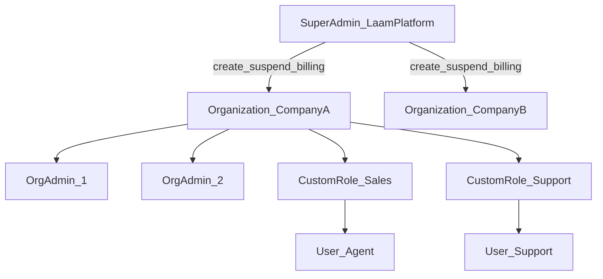
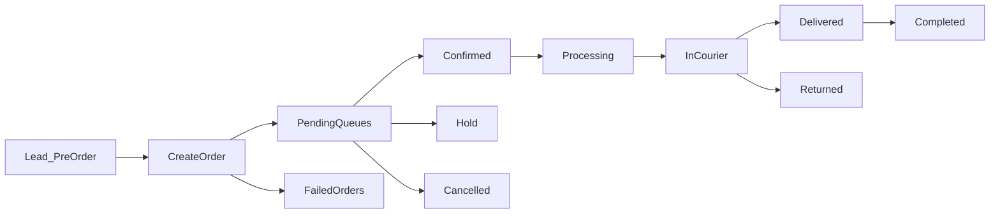
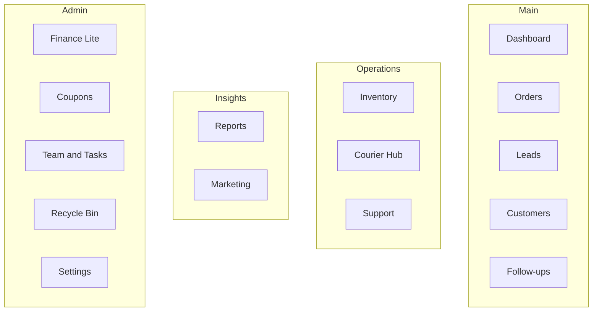

# Laam CRM — Product Specification

**Document type:** Product vision & feature specification (Laam-native)  
**Status:** Active — guides design and build  
**Last updated:** 2026-06-29  
**Owner:** Product (La'am)

> **Purpose:** This document defines **what Laam CRM is** and **what we will build** — a clean, easy-to-use, feature-rich, **multi-tenant SaaS** for Bangladesh e-commerce operations.  
> **Bizmation** is a **workflow reference**, not a 1:1 clone target. Field-level and screenshot inventory lives in [`bizmation-spec.md`](./bizmation-spec.md).

---

## 0. Product Overview

### 0.1 Vision

Laam CRM helps BD e-commerce teams run daily operations — orders, leads, customers, follow-ups, inventory, courier, support, and light finance — in **one modern system** with **minimal clicks** and **maximum clarity**.

| Dimension | Definition |
|-----------|------------|
| **Product type** | Order-centric operations CRM (not generic pipeline/deals CRM as primary story) |
| **Market context** | Teams already use Bizmation-style tools; Laam must feel familiar in *workflow* but better in *experience* |
| **Laam promise** | Easier than legacy admin UIs, more useful in real ops, fully dynamic (statuses, roles, queues) |
| **Architecture** | Multi-tenant SaaS from day one |
| **Long-term** | Ops MVP → Reports & Automations → HRM → Full Accounting |

### 0.2 Design principles

| Principle | Meaning |
|-----------|---------|
| **One pattern per job** | Same list engine, customer block, product picker, money summary everywhere |
| **Progressive disclosure** | Simple default view; advanced filters and bulk tools when needed |
| **Mobile-usable ops** | Tables become cards on small screens; touch-friendly actions |
| **Dynamic by default** | Order statuses, queues, nav items, permissions — admin-configurable, not hardcoded |
| **Clean, not cluttered** | Fewer sidebar duplicates; search and grouping instead of 30+ identical menus |
| **Real-world useful** | Features that reduce phone calls, copy-paste, and courier mistakes — not checkbox parity |

**Stakeholder note (Bangla):** Bizmation er shathe **fully match** korar kono requirement nai. Amra **easy + featureful + dynamic** CRM build korbo — je real business e daily kaaj e lage.

### 0.3 Relationship to Bizmation spec

| Document | Role |
|----------|------|
| **[`bizmation-spec.md`](./bizmation-spec.md)** | Reference inventory — screenshots, columns, filters, Bizmation menu list |
| **`laam-spec.md` (this doc)** | Laam product vision — modules, features, SaaS model, UX rules, phases |

When implementing a screen, read **Laam spec** for scope and UX; read **Bizmation spec** for field parity hints (e.g. [Batch 5b — All Orders](./bizmation-spec.md#batch-5b--orders--all-orders), [Batch 5a — Create Order](./bizmation-spec.md#batch-5a--orders--create-new)).

### 0.4 Delivery phases

| Phase | Focus | Data |
|-------|--------|------|
| **Phase 1 — Mockup UI** | Page-by-page Laam UI; click navigates; actions → toast; reload resets | Mock only |
| **Phase 2 — Backend** | API, Prisma, tenant isolation, permission enforcement, integrations | Real DB |
| **Phase 3 — Intelligence** | Reports, automations, scheduled jobs, webhooks | Production |
| **Phase 4 — HRM & Accounting** | Full HR and ledger modules | Future |

---

## 1. SaaS & Tenancy Model

### 1.1 Hierarchy

### 1.2 Roles & scope

| Level | Who | Can do | Cannot do |
|-------|-----|--------|-----------|
| **Super Admin** | Laam SaaS platform owner | Create/suspend tenants, plans, platform billing, health monitoring, onboarding | View **any** tenant's orders, customers, inventory, or operational reports |
| **Organization (Company / Tenant)** | One e-commerce business | Own isolated data space (`organizationId`) | Access other tenants' data |
| **Org Admin** | **Multiple admins per company** (confirmed) | Invite users, create roles, assign permissions, org settings, view org subscription | Access other companies |
| **Custom Role** | Defined by org admin | Permission set at page → section → field/line granularity | Exceed assigned permissions |
| **User (Staff)** | Sales, support, inventory, etc. | Work within role + optional grants/denies | See hidden sections/fields |

**Confirmed (Bangla):** Super Admin = SaaS er main owner. Proti **company** ekta tenant. **Akta company te multiple Org Admin** thakte pare (owner, co-founder, ops head, etc.).

### 1.3 Data isolation rules

- Every operational row scoped by `organizationId`
- API guards + Prisma filters enforce tenant boundary (Phase 2)
- Super Admin APIs: tenant metadata only (name, plan, status, billing) — **no** cross-tenant operational queries
- No "view as tenant user" / impersonation for Super Admin

**Code map:** [`packages/types/src/lib/rbac.ts`](../packages/types/src/lib/rbac.ts), [`permission-catalog.ts`](../packages/types/src/lib/permission-catalog.ts), [`mock-tenant-store.ts`](../apps/web/src/features/platform/data/mock-tenant-store.ts)

### 1.4 Permission model

**Hierarchy (fine → coarse):**

| Level | Example key | Effect |
|-------|-------------|--------|
| Line / element | `orders.detail.line.courier-success-rate` | Hide single stat |
| Field | `orders.edit.field.customer-phone` | Hide or read-only |
| Section | `orders.detail.section.payments` | Hide whole card |
| Column | `orders.list.column.summary` | Hide table column |
| Action | `orders.bulk.pathao` | Hide bulk button |
| Page | `orders.view` | Hide route + nav |
| Module | `orders` | Hide sidebar group |

**Phases:**

| Phase | Behavior |
|-------|----------|
| **Phase A (mock UI)** | All features open for all roles — dev/demo friendly; `<Can>` pattern in place |
| **Phase B (production)** | Strict UI hide + API 403; same permission keys on both layers |

Detail: [bizmation-spec Section 11](./bizmation-spec.md#11-auth-tenancy--permissions)

---

## 2. Laam UX Philosophy

### 2.1 Why Laam is easier than Bizmation

| Bizmation pain | Laam answer |
|----------------|-------------|
| 33+ order items in sidebar | **Smart Order Hub** — configurable queues, favorites, global search, group-by-status; new label ≠ new menu item |
| Followups 1 / 2 / 3 duplicate menus | **One Follow-ups module** with queue tabs |
| Courier settings + notifications scattered | **Courier Hub** — config, webhooks inbox, bulk submit together |
| Filters always expanded, heavy | Collapsible filter panel + **saved presets** |
| Different forms per module | Shared **CustomerBlock**, **ProductPicker**, **MoneySummary** |
| Hard to find order by phone | **Global search / command palette** (order ID, mobile, name) |
| Desktop-only tables | **CrmDataTable** — sticky header, mobile cards, copy actions ([`components/data-table/`](../apps/web/src/components/data-table/)) |

### 2.2 Global UX patterns (all modules)

| Pattern | Used in |
|---------|---------|
| **CrmDataTable** | Orders, Leads, Customers, Inventory lists, Reports tables |
| **PageShell + section cards** | All main pages |
| **Toolbar:** search + column toggle | List pages |
| **Bulk bar** | Orders, Leads, Customers when rows selected |
| **Toast feedback** | Mock phase actions |
| **Theme tokens only** | No raw emerald/teal — use `primary`, `destructive`, `muted`, etc. |

### 2.3 What we will NOT copy from Bizmation

- 33 separate sidebar entries for order statuses
- Three identical Follow-up top-level menus
- Module-level-only permission checkboxes without section granularity
- Always-open filter panels with no presets
- Single-tenant mental model

---

## 3. Module Map

| # | Module | Route (proposed) | Priority | Phase | Status |
|---|--------|------------------|----------|-------|--------|
| 1 | **Platform (Super Admin)** | `/dashboard/platform` | P0 | 1–2 | Partial mock |
| 2 | **Dashboard** | `/dashboard` | P0 | 1 | Role widgets live |
| 3 | **Orders** | `/dashboard/orders/*` | P0 | 1 | In progress |
| 4 | **Leads / Pre-Orders** | `/dashboard/leads` | P0 | 1 | Mock list live |
| 5 | **Customers** | `/dashboard/customers` | P0 | 1–2 | Planned |
| 6 | **Follow-ups** | `/dashboard/followups` | P1 | 2 | Planned |
| 7 | **Inventory** | `/dashboard/inventory/*` | P1 | 2 | Planned |
| 8 | **Courier Hub** | `/dashboard/courier` | P1 | 2 | Partial (order column) |
| 9 | **Support Tickets** | `/dashboard/support` | P1 | 2 | Planned |
| 10 | **Finance Lite** | `/dashboard/finance/*` | P2 | 2 | Planned |
| 11 | **Coupons** | `/dashboard/coupons` | P2 | 2 | Planned |
| 12 | **Reports & Analytics** | `/dashboard/reports` | P2 | 3 | Partial |
| 13 | **Marketing** | `/dashboard/campaigns` | P2 | 3 | Partial |
| 14 | **Team & Tasks** | `/dashboard/tasks`, `/dashboard/users` | P2 | 2–3 | Partial |
| 15 | **Settings** | `/dashboard/settings/*` | P2 | 2 | Partial |
| 16 | **Account & Security** | `/dashboard/settings/roles`, `/dashboard/users` | P2 | 2 | Partial |
| 17 | **Recycle Bin** | `/dashboard/recycle-bin` | P2 | 2 | Planned |
| 18 | **Automations** | `/dashboard/automations` | P3 | 3 | Planned |
| 19 | **HRM** | `/dashboard/hrm/*` | P4 | Future | — |
| 20 | **Accounting** | `/dashboard/accounting/*` | P4 | Future | — |

**Not core nav (optional / deprioritized):** Generic Pipeline and Deals as primary ops story — code may exist but not promoted in Laam sidebar. Bizmation does not use them; keeps product focused.

---

## 4. Module Specifications

### 4.1 Platform — Super Admin

**Route:** `/dashboard/platform`  
**Who:** Super Admin only  
**Bizmation reference:** Account → Billing (tenant-side); Laam extends to full SaaS platform.

| Feature | Description |
|---------|-------------|
| Tenant list | All companies: name, plan, status, created date |
| Create tenant | Company name, admin email, plan tier, trial period |
| Suspend / reactivate | Block login; retain data |
| Subscription overview | Credits, invoices, plan upgrades |
| System health | API uptime, queue depth, error rates |
| Onboarding wizard | Step-by-step first tenant setup |
| Platform settings | Global defaults, feature flags |

**Explicit exclusion:** No screen to browse tenant orders, customers, or inventory.

---

### 4.2 Dashboard

**Route:** `/dashboard`  
**Who:** All roles (widgets vary)

| Feature | Description |
|---------|-------------|
| Role-based layout | Sales Head, Agent, Marketing Head, Org Admin, Super Admin (platform only) |
| KPI cards | Total orders, revenue, pending count, cancelled, follow-ups due, courier success |
| Charts | Sales trend, status breakdown, revenue vs target |
| Quick actions | Create Order, global search |
| Date range | Global filter affects widgets |
| Permission-aware widgets | Hidden if role lacks permission |

**Bizmation reference:** [Batch 1 — Dashboard](./bizmation-spec.md#batch-1--login--dashboard) (deferred until ops modules mature; Laam uses interim role dashboards).

**Code:** [`role-dashboard.tsx`](../apps/web/src/features/dashboard/components/role-dashboard.tsx)

---

### 4.3 Orders (core module)

**Routes:** `/dashboard/orders`, `/dashboard/orders/new`, `/dashboard/orders/[orderId]`, queues, tools  
**Who:** Sales, ops, admin

#### 4.3.1 Order lifecycle (Laam model)

Statuses are **admin-configurable** — diagram shows typical BD flow, not fixed enum.

#### 4.3.2 Create Order

| Feature | Description |
|---------|-------------|
| Customer block | Name, phone (WhatsApp/call/copy), address, district, source |
| Product picker | Catalog search, line items, qty, price, discount |
| Other info | UTM, courier note, employee assign, tags |
| Summary panel | Subtotal, delivery, discount, paid, due, coupon |
| Payment | COD / partial / paid flags |
| Duplicate warning | Same phone + product within configurable window |
| Skip follow-up flag | Optional on create |

**Bizmation reference:** [Batch 5a — Create New](./bizmation-spec.md#batch-5a--orders--create-new)  
**Code:** [`/dashboard/orders/new`](../apps/web/src/app/(dashboard)/dashboard/orders/new/page.tsx)

#### 4.3.3 Order List (all queues)

| Feature | Description |
|---------|-------------|
| Universal table | CrmDataTable — sticky header, grid lines, fixed columns, mobile cards |
| Columns | Status, notes, ID & products, name & number, date, address, employee, summary, courier bar |
| Queue access | Sidebar favorites, group-by-status, status filter URL — not 33 hardcoded menus |
| Search | In-toolbar + global; order ID, phone, name, address, product, employee |
| Filters | Date, source, employee, district, payment, courier, product — collapsible |
| Filter presets | Save / load named presets per user or org |
| Sort | Column sort (API-ready) |
| Selection | Checkbox bulk select |
| Bulk actions | Print, barcode, export, SMS, status change, courier submit, transfer employee |
| Selection summary | Selected rows mini financial summary |
| Sales summary | Footer panel — totals, courier charges, profit (collapsible) |
| Pagination | Page size, prev/next |
| Copy actions | One-click copy date, address, employee |
| Drag scroll | Horizontal table scroll without blocking text select |

**Bizmation reference:** [Batch 5b — All Orders](./bizmation-spec.md#batch-5b--orders--all-orders), [Batch 5d — Status queues](./bizmation-spec.md#batch-5d--orders--status-queues)  
**Code:** [`order-list-shell.tsx`](../apps/web/src/features/orders/components/order-list/order-list-shell.tsx), [`order-table-columns.tsx`](../apps/web/src/features/orders/components/order-list/order-table-columns.tsx)

#### 4.3.4 Order detail & edit

| Feature | Description |
|---------|-------------|
| Timeline | Status changes, notes, SMS, courier events |
| Edit | Customer, products, address, payment, status |
| Notes | Internal + courier note |
| Courier tracking | Live status from courier API |
| View Lead link | Jump to pre-order if converted from lead |
| Print | Invoice, packing slip |

**Bizmation reference:** [Batch 5c — Order Detail](./bizmation-spec.md#batch-5c--orders--order-detail)

#### 4.3.5 Failed orders & tools

| Page | Feature |
|------|---------|
| **Failed Orders** | Separate queue for API/sync failures; retry actions |
| **Bulk Print** | Print selected labels/invoices |
| **Send Courier by Barcode** | Scan barcodes → bulk submit |
| **Payments** | Payment reconciliation view |

**Bizmation reference:** Orders dropdown items in [Batch 0](./bizmation-spec.md#orders-dropdown-33-items)

#### 4.3.6 Dynamic order configuration (Laam differentiator)

| Config item | Admin control |
|-------------|---------------|
| Status | Label, color, slug, terminal flag, group |
| Queue display | Sidebar / nested tab / group-by only / hidden |
| Bulk actions | Per-status allowed actions |
| Transitions | Any → any (config-driven) |
| Nav generation | From config + permissions — not hardcoded routes |

**Code (mock):** [`mock-status-config.ts`](../apps/web/src/features/orders/data/mock-status-config.ts), [`order-queue-resolver.ts`](../apps/web/src/features/orders/config/order-queue-resolver.ts)

---

### 4.4 Leads / Pre-Orders

**Route:** `/dashboard/leads`, `/dashboard/leads/[leadId]`  
**Bizmation menu:** Pre Orders/Lead

| Feature | Description |
|---------|-------------|
| List table | Lead ID, customer, source, status, campaign, value, agent, date |
| Source filters | Facebook, call, ecommerce, walk-in, unassigned |
| Search | Name, phone, campaign |
| Create pre-order | Lighter form than full order |
| Convert to order | One-click with data carry-over |
| Bulk actions | Note, confirm, follow-up, SMS, assign agent |
| Detail | Timeline, products, link to order after convert |

**Bizmation reference:** [Batch 2 — Pre Orders/Lead](./bizmation-spec.md#batch-2--pre-orderslead--laam-leads-map)

---

### 4.5 Customers

**Route:** `/dashboard/customers` (B2C primary; not generic B2B companies as main CRM object)  
**Bizmation menu:** Customers

| Feature | Description |
|---------|-------------|
| List | Mobile-centric; name, phone, tags, last order, order count, total spent |
| Filters | Date ranges, follow-up status, district, order status/source, product, courier success rate |
| Segments | Saved filter groups ("VIP", "High return risk") |
| Courier score | Success rate badge per customer |
| Bulk SMS / follow-up | Select many → action |
| Detail | Order history table, notes, tags, address book |
| Import | CSV import with mapping |

**Bizmation reference:** [Batch 3 — Customers](./bizmation-spec.md#batch-3--customers)

---

### 4.6 Follow-ups

**Route:** `/dashboard/followups?queue=1|2|3`  
**Replaces:** Bizmation's three duplicate top-level menus

| Feature | Description |
|---------|-------------|
| Unified list | Same UI as order list pattern |
| Queue tabs | Tab 1 / 2 / 3 (or admin-renamed queues) |
| Schedule callback | Date/time picker |
| Notes | Per follow-up |
| Status | Pending, done, converted |
| Convert to order | One click |
| Nav badge | Count per queue |
| Calendar view | Optional Phase 3 |

**Bizmation reference:** Followups menus in [Batch 0](./bizmation-spec.md#top-level-menu) — Laam consolidates to one module.

---

### 4.7 Inventory

**Route:** `/dashboard/inventory/*`  
**Bizmation:** Inventory dropdown (6 items)

| Sub-module | Route | Features |
|------------|-------|----------|
| **Products** | `/inventory/products` | SKU, name, price, stock, variants, images, categories |
| **Suppliers** | `/inventory/suppliers` | Vendor contact, ledger, balance |
| **Purchase** | `/inventory/purchase` | Stock in, line items, payment status |
| **Purchase Returns** | `/inventory/purchase-returns` | Return to supplier |
| **Mixer** | `/inventory/mixer` | Raw materials → finished goods recipe |
| **Stock Adjustment** | `/inventory/adjustment` | Manual +/- with reason, audit |

**Cross-cutting:** Low-stock alerts on Dashboard; product picker reads from Products catalog.

**Bizmation reference:** [Inventory dropdown](./bizmation-spec.md#inventory-dropdown)

---

### 4.8 Courier Hub

**Route:** `/dashboard/courier` (config + inbox + tools)  
**Replaces:** Bizmation Settings → Courier + Steadfast Notifications as separate silos

| Feature | Description |
|---------|-------------|
| Courier accounts | Pathao, Steadfast, Carrybee, REDX, eCourier, etc. |
| Global rules | COD handling, charge %, default courier |
| Webhook inbox | Tracking updates, rider assigned, COD collected |
| Bulk submit | Selected orders → courier API |
| Barcode scan | Tool integration with Orders |
| Per-order stats | To / Co / Su / Fa bar + percent in order list |

**Bizmation reference:** [Settings → Courier](./bizmation-spec.md#settings-dropdown), Steadfast Notifications in [Batch 0](./bizmation-spec.md#top-level-menu)

---

### 4.9 Support Tickets

**Route:** `/dashboard/support`  
**Bizmation menu:** Support Tickets

| Feature | Description |
|---------|-------------|
| Ticket list | Status, priority, customer, assignee, created |
| Create | Subject, body, attachments |
| Detail thread | Chat-style messages |
| Assign / transfer | Agent handoff |
| Link | Connect ticket ↔ order ↔ customer |

**Bizmation reference:** Support section in [bizmation-spec MVP table](./bizmation-spec.md#02-mvp--high-level-scope)

---

### 4.10 Finance Lite

**Routes:** `/dashboard/finance/expenses`, `/dashboard/finance/incomes`  
**Not full accounting** — operational cash tracking only

| Feature | Description |
|---------|-------------|
| Other Expense | Amount, date, purpose category, note, attachment |
| Other Income | Same pattern |
| Categories | Admin-managed purpose list |
| Filters & export | Date range, CSV |
| Future bridge | Phase 4 full Accounting module |

**Bizmation reference:** Other Expense / Other Incomes in [Batch 0](./bizmation-spec.md#top-level-menu)

---

### 4.11 Coupons

**Route:** `/dashboard/coupons`

| Feature | Description |
|---------|-------------|
| List | Code, type (% / fixed), expiry, usage count |
| Create / edit | Min order, max discount, active flag |
| Apply on order | Create order summary integration |
| Stats | Redemption rate |

**Bizmation reference:** Coupons in [Batch 0](./bizmation-spec.md#top-level-menu)

---

### 4.12 Reports & Analytics

**Route:** `/dashboard/reports?view=…`

| Report | Description |
|--------|-------------|
| Summary | Overview KPIs |
| Repeat customers | Retention metrics |
| Product sales | By SKU, period |
| Product daily sales | Time series |
| Top / bottom products | Sold, returned, stock |
| Employee activity | Actions per user |
| Orders by employee | Performance |
| Login histories | Security audit |
| Up-sales | Cross-sell metrics |
| Meta Ads | Campaign ROI |
| Export | CSV / PDF |
| Scheduled email | Phase 3 — weekly digest |

**Bizmation reference:** [Reports dropdown (12 items)](./bizmation-spec.md#reports-dropdown)

---

### 4.13 Marketing (Laam extra)

**Route:** `/dashboard/campaigns`

| Feature | Description |
|---------|-------------|
| Campaign list | Active/paused campaigns |
| Ad budget | Spend tracking |
| Lead source attribution | Tie leads/orders to campaign |
| Landing performance | If website sync enabled |

**Note:** Bizmation embeds Meta Ads under Reports; Laam gives Marketing its own hub for clarity.

---

### 4.14 Team & Tasks (Laam extra)

**Routes:** `/dashboard/users`, `/dashboard/tasks`, `/dashboard/activities`

| Feature | Description |
|---------|-------------|
| Team agents | List, role, active orders count |
| Targets | Monthly order/revenue goals |
| Tasks | Assign to user, due date, link to order/lead |
| Activity feed | Who changed status, reassigned, added note |

---

### 4.15 Settings

**Route:** `/dashboard/settings/*`

| Section | Features |
|---------|----------|
| **General** | Business name, logo, invoice template, order defaults |
| **Website / Landing sync** | WordPress multi-site, API token, stock sync, duplicate detect (72h, IP, name), OTP |
| **SMS** | Provider, templates per order status, post-delivery rules |
| **Email** | Enable + toggles per status |
| **Import** | Customers, products, orders + queue history |
| **Catalog** | Categories, brands, attributes |
| **Order statuses** | Full dynamic config UI (replaces hardcoded nav) |

**Bizmation reference:** [Settings dropdown (9 items)](./bizmation-spec.md#settings-dropdown)

---

### 4.16 Account & Security

**Routes:** `/dashboard/settings/roles`, `/dashboard/users`, `/dashboard/billing`, `/dashboard/security/blocked`

| Feature | Description |
|---------|-------------|
| **Roles** | Tree permission editor — page → section → line |
| **Users / Admins** | Invite, assign role, OTP login, order distribution rules |
| **Org billing** | Tenant's Laam subscription (not customer payments) |
| **IP / Mobile block** | Fraud prevention list |
| **Audit log** | Phase 2 — who did what, when |

**Bizmation reference:** [Account section — Batch 0](./bizmation-spec.md#account-section), Roles in [Batch 7](./bizmation-spec.md#batch-7--account)

**Confirmed:** Multiple **Org Admins** per company; all can manage users/roles unless restricted by custom policy later.

---

### 4.17 Recycle Bin

**Route:** `/dashboard/recycle-bin`

| Feature | Description |
|---------|-------------|
| Restore | Orders, customers, products, categories |
| Soft delete | All deletes go to bin first |
| Auto-purge | Configurable retention days |

**Bizmation reference:** Recycle Bin in [Batch 0](./bizmation-spec.md#top-level-menu)

---

### 4.18 Automations (Phase 3 — Laam differentiator)

**Route:** `/dashboard/automations`

| Feature | Description |
|---------|-------------|
| Status rules | When status = X → send SMS, assign agent, add tag |
| SLA reminders | Follow-up overdue → notify manager |
| Webhooks | Outbound HTTP on order events |
| Assignment rules | Round-robin, by district, by product |

**Not in Bizmation** — Laam adds this for real-world ops efficiency.

---

### 4.19 HRM & Accounting (Phase 4 — Future)

| Module | Planned features |
|--------|------------------|
| **HRM** | Attendance, leave, payroll, employee records |
| **Accounting** | Chart of accounts, journal, P&L, balance sheet, tax |

Bizmation today: light expense/income + HR shortcuts only. Laam Phase 4 = full modules.

---

## 5. Dynamic Configuration (Cross-Cutting)

Laam treats **configuration as product**, not code deployment.

| Domain | Configurable by org admin | Stored as |
|--------|---------------------------|-----------|
| Order statuses | Label, color, group, queue placement, bulk actions | DB / JSON config |
| Order queues | Nav visibility, parent/child, default tab | Queue pages registry |
| Permissions | Page/section/line tree | Permission catalog + role |
| Nav sidebar | Generated from config + role filter | Server-driven nav |
| SMS templates | Per status | Settings |
| Filter presets | Per user or org | User preferences |
| Automation rules | Triggers + actions | Automations module |

**Implementation direction:** Evolve [`build-orders-nav.ts`](../apps/web/src/features/orders/config/build-orders-nav.ts) from static mock to API-driven nav builder.

---

## 6. Technical & Delivery Notes

### 6.1 Monorepo layout

| Package | Role |
|---------|------|
| `apps/web` | Next.js App Router — Laam UI |
| `apps/api` | NestJS — REST API (Phase 2) |
| `packages/types` | Shared Zod schemas, permissions, order types |

### 6.2 Reusable UI building blocks (built / in progress)

| Component | Purpose |
|-----------|---------|
| [`CrmDataTable`](../apps/web/src/components/data-table/crm-data-table.tsx) | Universal list engine |
| [`OrderListShell`](../apps/web/src/features/orders/components/order-list/order-list-shell.tsx) | Orders page orchestration |
| Create Order sections | Customer, products, summary |
| [`FormPhoneInput`](../apps/web/src/components/form/form-phone-input.tsx) | Phone + WhatsApp/call/copy |
| `<Can>` permission wrapper | Future strict mode |

### 6.3 Phase 1 mock rules

| Behavior | Mock phase |
|----------|------------|
| Navigation | Real routes |
| Save / bulk / status change | Toast + in-memory update |
| Reload | State resets |
| API / DB | None |

### 6.4 Phase 2 production rules

| Behavior | Production |
|----------|------------|
| Auth | Real login, JWT/session |
| Tenancy | `organizationId` on every query |
| Permissions | UI + API enforced |
| Integrations | Courier, SMS, WordPress webhooks |

---

## 7. Sidebar Navigation (Laam Target)

Proposed **clean** sidebar — fewer items, logical groups:

**Orders** expands to: All Orders, Create New, Failed, Favorites (user-pinned queues), More Statuses (config page) — **not** 33 static items.

---

## 8. Open Decisions & Review Checklist

| ID | Topic | Status | Notes |
|----|-------|--------|-------|
| L-001 | Bizmation 1:1 parity | **Rejected** | Workflow reference only |
| L-002 | Multiple Org Admins per company | **Confirmed** | This spec |
| L-003 | Super Admin tenant data access | **Denied** | Platform metadata only |
| L-004 | Pipeline/Deals in core nav | **Deprioritized** | Optional later |
| L-005 | Dashboard widget set | **Deferred** | After core ops mockups |
| L-006 | Automations scope Phase 3 | **Proposed** | Review before build |

**Review ask:** Confirm module priority order (Section 3) and Phase 2 vs 3 split before backend sprint.

---

## 9. Document Index

| Section | Content |
|---------|---------|
| **0** | Vision, principles, phases |
| **1** | SaaS tenancy, permissions |
| **2** | UX philosophy vs Bizmation |
| **3** | Module map |
| **4** | Per-module features |
| **5** | Dynamic configuration |
| **6** | Technical notes |
| **7** | Target sidebar |
| **8** | Open decisions |

**Related:** [`bizmation-spec.md`](./bizmation-spec.md) — screenshot batches, field inventory, Bizmation menu reference.

---

*End of Laam CRM Product Specification*
