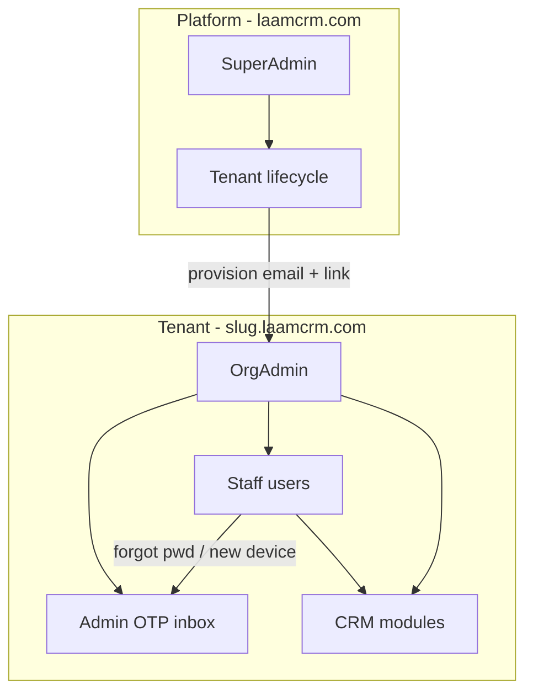

# Laam CRM — Backend Specification

> **Status:** Spec only — no implementation without explicit approval.  
> **Stack:** NestJS (`apps/api`), Prisma + PostgreSQL, Redis (OTP), Next.js web (`apps/web`).  
> **Types:** Shared contracts in `packages/types` — API must match these Zod schemas.

---

## 1. Architecture overview



| Layer | Responsibility |
|-------|----------------|
| **Platform** | Super admin, tenant CRUD, company block/unblock, billing (later) |
| **Tenant** | Org-scoped CRM; all business data has `organizationId` |
| **Auth** | JWT session, OTP challenges, trusted devices |
| **Ops spine** | Server-side order lifecycle side-effects (replaces web `ops-spine/domain-events.ts`) |

### Environment flags

| Variable | Purpose |
|----------|---------|
| `NEXT_PUBLIC_USE_API=true` | Web uses HTTP APIs instead of client mocks |
| `DATABASE_URL` | PostgreSQL |
| `REDIS_URL` | OTP storage, rate limits |
| `JWT_SECRET` | Access token signing |
| `SUPER_ADMIN_EMAIL` | Seed only — **never commit password** |
| `SUPER_ADMIN_PASSWORD` | Seed only — set in local `.env`, not in git |
| `EMAIL_MODE=mock` | Dev: OTP logged + returned in dev header; `smtp` for production |

### Local dev tenancy (no DNS required)

| Production | Local equivalent |
|------------|------------------|
| `laamcrm.com` | `http://localhost:3000` (no tenant slug) |
| `laam.laamcrm.com` | `http://localhost:3000?tenant=laam` or `laam.localhost:3000` |

API resolves tenant from `Host` header or `X-Tenant-Slug` / query `tenant`.

---

## 2. Module build order

| Phase | Module | Priority | Depends on |
|-------|--------|----------|------------|
| **0** | Auth + Platform + Tenant | **Start here** | — |
| **1** | Settings (org profile, integrations) | High | Phase 0 |
| **1** | Users / RBAC / Teams | High | Phase 0 |
| **2** | Customers | High | Phase 0 |
| **2** | Inventory (products, stock) | High | Phase 0 |
| **2** | Coupons | Medium | Inventory |
| **3** | Orders + ops-spine | **Hub** | Customers, Inventory, Settings |
| **4** | Courier | High | Orders |
| **4** | Followups | High | Orders, Customers |
| **4** | Order payments / failed orders | High | Orders |
| **5** | Accounting | High | Orders, Inventory |
| **6** | Leads, Contacts, Companies, Deals, Pipeline | Medium | Phase 0 (partial API exists) |
| **7** | Tasks, Support, Security, Notifications | Medium | Users |
| **8** | Reports, Dashboard, Nav badges | Low | Many modules |
| **9** | Data import, Recycle bin | Low | Customers, Orders |
| **10** | Billing, Campaigns, Knowledge | Later | Platform |

**Current API state:** Read-only fixtures for leads, contacts, companies, deals, pipeline, orders (`apps/api/src/crm/data/crm-fixtures.ts`). Prisma schema exists but is **not wired**. No auth.

---

## 3. Phase 0 — Auth, platform & tenancy

### 3.1 User roles

From `packages/types/src/lib/roles.ts`:

| Role | Scope | Login domain |
|------|-------|--------------|
| `super_admin` | Platform | `laamcrm.com` |
| `org_admin` | One organization | `{slug}.laamcrm.com` |
| `ceo`, `team_leader`, `sales_manager`, `sales_rep`, … | Organization | Tenant subdomain |
| Staff | Organization | Tenant subdomain |

### 3.2 OTP rules (product requirement)

| Rule | Value |
|------|-------|
| OTP length | 6 digits |
| OTP TTL | **1 minute** |
| Resend cooldown | **1 minute** |
| Max attempts | 5 per challenge |

| Actor | OTP delivery |
|-------|----------------|
| Super admin | Email |
| Org admin | Email |
| All other staff | **Admin OTP inbox** in CRM (not email) |

| Purpose | Who gets OTP |
|---------|----------------|
| Forgot password (super admin) | Super admin email |
| Forgot password (org admin) | Org admin email |
| Forgot password (staff) | Admin inbox → admin gives OTP to user |
| Org admin change own password | Org admin email |
| Staff new device first login | Admin inbox |
| Tenant provisioning | Email to owner (link + temp credentials) |

**Dev (`EMAIL_MODE=mock`):** OTP also written to server log and optional `X-Dev-Otp` response header. No SMTP required.

### 3.3 Auth API endpoints

Base: `/api/auth` (matches `apps/web/src/lib/api/endpoints.ts`)

| Method | Path | Description |
|--------|------|-------------|
| `POST` | `/auth/login` | Email + password → JWT + session body |
| `POST` | `/auth/logout` | Invalidate session |
| `GET` | `/auth/session` | Current user + organization |
| `POST` | `/auth/forgot-password` | Start OTP challenge |
| `POST` | `/auth/forgot-password/resend` | Resend after cooldown |
| `POST` | `/auth/forgot-password/verify` | OTP + new password |
| `POST` | `/auth/change-password` | Logged-in; admin → email OTP; staff → admin inbox flow |
| `POST` | `/auth/verify-device` | New device: OTP from admin inbox |
| `GET` | `/auth/otp-inbox` | Org admin: pending staff OTP requests |
| `POST` | `/auth/otp-inbox/:id/approve` | Admin marks OTP as consumed / relays to user |

**Session response** — `authSessionSchema` in `packages/types/src/lib/user.ts`:

```ts
{ user: SessionUser, organization: Organization }
```

Super admin session: `organization` may be a platform pseudo-org or omitted with `role: super_admin` only (decide at implement time; web must handle).

### 3.4 Platform / tenant API endpoints

New module: `apps/api/src/platform/`

| Method | Path | Permission | Description |
|--------|------|------------|-------------|
| `GET` | `/platform/tenants` | `super_admin` | List all tenants |
| `POST` | `/platform/tenants` | `super_admin` | Create tenant + owner user |
| `GET` | `/platform/tenants/:id` | `super_admin` | Tenant detail |
| `PATCH` | `/platform/tenants/:id/status` | `super_admin` | `active` / `suspended` / `onboarding` |
| `POST` | `/platform/tenants/:id/admins` | `super_admin` | Add org admin to company |
| `PATCH` | `/platform/tenants/:id/admins/:userId/status` | `super_admin` | Block/unblock admin |
| `POST` | `/platform/tenants/:id/resend-invite` | `super_admin` | Resend onboarding email |

**Create tenant payload** — `createTenantRequestSchema` (`packages/types/src/lib/tenant.ts`):

```ts
{ name, slug, plan, owner: { name, email, phone? } }
```

**Provision flow:**

1. Super admin creates tenant → status `onboarding`
2. System creates `Organization` + owner `User` (`org_admin`) with temp password
3. Email (or dev log): `https://{slug}.laamcrm.com` + credentials
4. Owner first login → forced password change (optional policy)
5. Super admin sets status `active`

### 3.5 Prisma models (Phase 0)

```prisma
model Organization {
  id        String   @id @default(cuid())
  name      String
  slug      String   @unique
  plan      String
  status    String   // active | suspended | onboarding
  createdAt DateTime @default(now())
  updatedAt DateTime @updatedAt
  users     User[]
}

model User {
  id             String    @id @default(cuid())
  email          String    @unique
  passwordHash   String
  name           String
  systemRole     String    // super_admin | org_admin | sales_rep | ...
  status         String    // active | invited | suspended
  organizationId String?
  organization   Organization? @relation(...)
  customRoleId   String?
  permissionGrants String[] @default([])
  permissionDenies String[] @default([])
  lastSeenAt     DateTime?
  createdAt      DateTime  @default(now())
  updatedAt      DateTime  @updatedAt
}

model OtpChallenge {
  id             String   @id @default(cuid())
  purpose        String   // forgot_password | change_password | new_device | tenant_invite
  email          String
  userId         String?
  organizationId String?
  codeHash       String
  expiresAt      DateTime
  resendAfter    DateTime
  attempts       Int      @default(0)
  consumedAt     DateTime?
  delivery       String   // email | admin_inbox
  createdAt      DateTime @default(now())
}

model TrustedDevice {
  id        String   @id @default(cuid())
  userId    String
  deviceId  String   // client-generated or fingerprint hash
  label     String?
  trustedAt DateTime @default(now())
  @@unique([userId, deviceId])
}

model RefreshToken { ... }  // optional: httpOnly cookie rotation
```

Add `organizationId` to all existing CRM models when each module is migrated from fixtures.

### 3.6 Seed

On `pnpm db:seed`:

- Create super admin from `SUPER_ADMIN_EMAIL` + `SUPER_ADMIN_PASSWORD` (env only)
- Do **not** hardcode credentials in source or this file

### 3.7 Guards & middleware

- `JwtAuthGuard` on all `/crm/*` and `/platform/*`
- `RolesGuard` + `@RequirePermissions()` from `packages/types` permission catalog
- `TenantMiddleware`: resolve `organizationId` from subdomain; reject if tenant `suspended`
- Super admin routes skip tenant scope

### 3.8 Frontend wiring (Phase 0)

| File | Change |
|------|--------|
| `apps/web/src/features/auth/providers/auth-provider.tsx` | Use HTTP auth when `NEXT_PUBLIC_USE_API=true` |
| `apps/web/src/lib/api/client.ts` | Attach JWT from cookie/memory |
| `apps/web/src/features/platform/api/tenant-api.ts` | Add `createHttpTenantApi()` |
| New: Admin OTP inbox page | Under Settings or Security |
| Dev OTP panel | Show last OTP in dev tools (optional) |

---

## 4. Phase 1 — Settings & users

### 4.1 Settings (`/crm/settings`)

**Web contract:** `apps/web/src/features/settings/api/org-settings-api.ts`

| Method | Path | Description |
|--------|------|-------------|
| `GET` | `/crm/settings` | Full org settings blob |
| `PATCH` | `/crm/settings/profile` | Name, order prefix, timezone, courier default |
| `PUT` | `/crm/settings/integrations` | Courier, bKash, SMTP, WooCommerce configs |
| `DELETE` | `/crm/settings/integrations/:provider` | Remove integration |

**DB:** `OrganizationSettings` JSON or normalized tables. Categories & order statuses: migrate from web localStorage to `OrgCategory` + `OrderStatusConfig` tables (per org).

### 4.2 Users / RBAC (`/crm/users`)

**Web contract:** `apps/web/src/features/rbac/api/rbac-api.ts` (currently mock-only)

| Method | Path | Description |
|--------|------|-------------|
| `GET` | `/crm/users` | List org users + ACL |
| `POST` | `/crm/users` | Invite/create user |
| `PATCH` | `/crm/users/:id` | Update ACL, role, team |
| `PATCH` | `/crm/users/:id/status` | Block/unblock |
| `GET` | `/crm/roles` | Custom roles |
| `POST` | `/crm/roles` | Create custom role |
| `PATCH` | `/crm/roles/:id` | Update permissions |
| `DELETE` | `/crm/roles/:id` | Delete custom role |
| `GET` | `/crm/teams` | Org teams |
| `POST` | `/crm/teams` | Create team |

Types: `CustomRole`, `UserAcl`, `OrgTeam` in `packages/types`.

Staff password reset: triggers OTP to **admin inbox**, not email.

---

## 5. Phase 2 — Customers & inventory

### 5.1 Customers (`/crm/customers`)

**Web contract:** `apps/web/src/features/customers/api/customers-api.ts`

| Method | Path | Description |
|--------|------|-------------|
| `GET` | `/crm/customers` | List + segments + summary |
| `GET` | `/crm/customers/:id` | Detail + order history, courier score |
| `PATCH` | `/crm/customers/:id` | Update status, notes |
| `POST` | `/crm/customers/merge` | Merge duplicates |

**Prisma:** `Customer` (phone unique per org, stats denormalized or computed).

**Why before orders:** Order create does customer lookup; ops-spine upserts customer on order created.

### 5.2 Inventory (`/crm/inventory`)

**Web contract:** `apps/web/src/features/inventory/api/inventory-api.ts`

| Resource | Endpoints |
|----------|-----------|
| Products | `GET/POST /products`, `GET/PATCH /products/:id`, bulk actions |
| Suppliers | `GET /suppliers` |
| Purchases | `GET /purchases`, `POST /purchases/:id/receive` |
| Purchase returns | `GET /purchase-returns` |
| Adjustments | `GET/POST /adjustments` |
| Mixer | `GET /mixer`, `POST /mixer/preview`, `POST /mixer/run`, `GET /mixer/runs` |

**Prisma:** `Product`, `ProductVariant`, `Supplier`, `StockMovement`, `Purchase`, etc.

**Categories:** Org-scoped `OrgCategory` kind `product` (replace web localStorage store).

### 5.3 Coupons (`/crm/coupons`)

| Method | Path |
|--------|------|
| `GET` | `/crm/coupons` |
| `POST` | `/crm/coupons` |
| `POST` | `/crm/coupons/:id/toggle` |

---

## 6. Phase 3 — Orders & ops-spine (hub)

### 6.1 Orders (`/crm/orders`)

**Web contract:** `apps/web/src/features/orders/api/orders-api.ts`

| Method | Path | Description |
|--------|------|-------------|
| `GET` | `/crm/orders` | List + filters + status counts |
| `GET` | `/crm/orders/:id` | Detail + timeline + line items |
| `POST` | `/crm/orders` | Create order |
| `PATCH` | `/crm/orders/:id` | Update fields / status |
| `GET` | `/crm/orders/check-duplicate` | By phone |
| `GET` | `/crm/orders/by-phone` | Customer order history |
| `POST` | `/crm/orders/bulk` | Status, transfer, courier, SMS, export |
| `POST` | `/crm/orders/bulk/follow-up` | Schedule followups |
| `GET` | `/crm/orders/:id/courier` | Tracking |
| `PATCH` | `/crm/orders/:id/note` | Order note |

**Prisma:** `Order`, `OrderLineItem`, `OrderTimelineEvent`, `OrderStatus` config per org.

**Create order payload** must eventually include: `customerNote`, UTM fields (extend `createOrderPayloadSchema`).

### 6.2 Server-side ops-spine

Replace `apps/web/src/features/ops-spine/domain-events.ts` with NestJS event handlers:

| Event | Triggers | Side effects |
|-------|----------|--------------|
| `order.created` | POST order | Customer upsert, stock decrement, followup, coupon usage |
| `order.status_changed` | PATCH status | Courier queue, cancel restock, revenue/COGS, receivables, automations |
| `order.paid` | Payment recorded | Income entry, receivable settlement |
| `courier.submitted` | Courier API | Inbox event, order status update |

**Critical:** All courier submit paths (Hub, barcode, bulk) must call **one** `courierApi.submitOrders` — not mock-only bulk action.

### 6.3 Order satellites

| Module | Base path |
|--------|-----------|
| Failed orders | `/crm/orders/failed` |
| Payments | `/crm/orders/payments` |

### 6.4 Courier (`/crm/courier`)

| Method | Path |
|--------|------|
| `GET` | `/crm/courier/overview` |
| `POST` | `/crm/courier/submit` |
| `POST` | `/crm/courier/inbox/:eventId/read` |

---

## 7. Phase 4–5 — Money & workflows

### 7.1 Followups (`/crm/followups`)

List, detail, patch, bulk — matches `followups-api.ts`.

### 7.2 Accounting (`/crm/accounting`)

| Area | Paths |
|------|-------|
| Overview | `/overview` |
| Income / expenses | `/income`, `/expenses` (GET + POST) |
| Ledger | `/ledger` |
| Receivables / payables | `/receivables`, `/payables` + collect/pay actions |
| Cash & bank | `/cash-bank` |
| Chart of accounts | `/chart-of-accounts` |
| Reports | `/reports/profit-loss`, `/reports/balance-sheet` |

**Categories:** Org-scoped income/expense categories. COA per org.

### 7.3 Tasks (`/crm/tasks`)

CRUD + list filters — `tasks-api.ts`.

---

## 8. Phase 6 — CRM pipeline

Partial fixtures exist. Migrate to Prisma + add writes.

| Module | Base | Status |
|--------|------|--------|
| Leads | `/crm/leads` | GET only |
| Contacts | `/crm/contacts` | GET only |
| Companies | `/crm/companies` | GET only |
| Deals | `/crm/deals` | GET only |
| Pipeline | `/crm/pipeline` | GET only |

**Add:** lead convert → order, activities, notes, assignment.

---

## 9. Phase 7–10 — Supporting modules

### 9.1 Security (`/crm/security/blocked`)

Block phone/customer from ordering.

### 9.2 Support (`/crm/support/tickets`)

Ticket CRUD + replies.

### 9.3 Notifications (`/crm/notifications`)

In-app notification feed.

### 9.4 Knowledge (`/crm/knowledge`)

Articles CRUD; categories per org.

### 9.5 Reports & dashboard

| Path | Purpose |
|------|---------|
| `/crm/reports/*` | Many report endpoints in `reports-api.ts` |
| `/crm/dashboard`, `/crm/dashboard/stats` | Role-based dashboard |
| `/crm/nav/badges` | Sidebar counts |

### 9.6 Data import & recycle bin

| Path | Purpose |
|------|---------|
| `POST /crm/import/:entityType` | customers, orders |
| `/crm/recycle-bin` | Soft-delete restore/purge |

### 9.7 Billing & campaigns

| Path | Purpose |
|------|---------|
| `/crm/billing/*` | Tenant subscription |
| `/crm/platform/billing` | Super admin view |
| `/crm/campaigns/overview` | Ad performance |

---

## 10. Cross-cutting concerns

### 10.1 Multi-tenancy

Every business row: `organizationId String` + index. All queries filtered by JWT org (except super admin).

### 10.2 Permissions

Use `packages/types/src/lib/permission-catalog.ts`. Enforce with `@RequirePermissions('orders.view')` etc.

### 10.3 Soft delete

Entities support recycle bin: `deletedAt` nullable timestamp.

### 10.4 API conventions

- Prefix: `/api`
- Pagination: `?page=1&pageSize=20`
- Errors: `{ message, code?, fieldErrors? }`
- Dates: ISO 8601 strings (match existing types)

### 10.5 Testing checklist per module

- [ ] Types match `packages/types` Zod schemas
- [ ] Tenant isolation (user A cannot read org B)
- [ ] Permission denied returns 403
- [ ] `NEXT_PUBLIC_USE_API=true` web flow works
- [ ] Seed data for demo org

---

## 11. Implementation approval

| Step | Owner | Status |
|------|-------|--------|
| Spec review | Product | **This document** |
| Phase 0 implement | Dev | **Waiting for approval** |
| Super admin seed | Ops | Set `SUPER_ADMIN_EMAIL` + `SUPER_ADMIN_PASSWORD` in `.env` only |

**To start coding:** explicit approval required (e.g. “Phase 0 implement koro”).

---

## 12. Known gaps to fix during implementation

1. **Courier submit** — unify Hub + barcode + bulk through `POST /crm/courier/submit`
2. **Order create** — persist `customerNote` + UTM fields
3. **Nav badges** — HTTP mode must not read client mocks
4. **Prisma vs types** — existing schema is flatter than `@laam/types`; expand per module

---

*Last updated: 2026-07-06*
